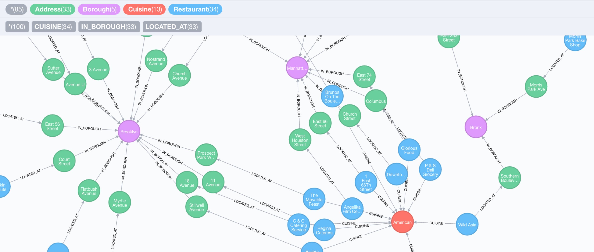

= Database Integration, Import and Export with APOC (Awesome Procedures On Cypher)
:overview: https://raw.githubusercontent.com/neo4j-contrib/neo4j-apoc-procedures/master/docs/overview.adoc

If you haven't seen the first part of this series, make sure to https://neo4j.com/blog/intro-user-defined-procedures-apoc/[check out the first article] to get an introduction to Neo4j's user defined procedures and our http://github.com/neo4j-contrib/neo4j-apoc-procedures[APOC procedure library].

== New APOC Release

First of all I want to announce that we just released *APOC version 3.0.4.1*
You might notice the new versioning scheme which became necessary with SPI changes in Neo4j 3.0.4 which caused earlier versions of APOC to break.

That's why we decided to release APOC versions that are tied to the Neo4j version _from which_ they are meant to work.
The last number is an ever increasing APOC build number, starting with 1.

So if you are using Neo4j 3.0.4 please upgrade to the new version, which is available as usual from http://github.com/neo4j-contrib/neo4j-apoc-procedures/releases

Notable Changes since the last release, please find https://neo4j-contrib.github.io/neo4j-apoc-procedures/#_overview_of_apoc_procedures[more details in the docs].

* Random Graph Generators (by Michal Bachman from GraphAware)
* Added Export (and Import) for GraphML `apoc.export.graphml.*`
* PageRank implementation that supports pulling the subgraph to run on with Cypher statements `apoc.algo.pageRankCypher` (by Atul Jangra from RightRelevance)
* Basic Weakly Connected Components Implementation (by Tom Michiels and Sascha Peukert)
* Better error messages for `load.json` and `periodic.iterate`
* support for leading wildcards "*foo" in `apoc.index.search` (by Stefan Armbruster)
* `apoc.schema.properties.distinct` provides distinct values of indexed properties using the index (by Max de Marzi)
* timeboxed execution of cypher statements (by Stefan Armbruster)
* Linking of a collection of nodes with `apoc.nodes.link` in a chain 
* `apoc.util.sleep` e.g. for testing  (by Stefan Armbruster)
// * coll.pairs and new coll.parisMin and coll.zip return type List of List
* Build switched to gradle, including release  (by Stefan Armbruster)

We got also a number of documentation updates by active contributors like Dana, Chris, Kevin, Viksit.

Thanks so much to everyone for contributing to APOC, we're now at 227 procedures and counting :)

If you missed it, you can also see what was included in the https://neo4j.com/blog/apoc-1-1-0-release-awesome-procedures-cypher/[previous release APOC 1.1.0].

But now back to demonstrating the main topics for this blog post.

== Database Integration & Data Import

For me personally besides the flexibility of the graph datamodel, the ability to enrich your existing graph by relating data from other datasources is a key advantage of using this technology.

And Neo4j data import has been a very enjoyable past time of mine, which you know if you followed https://github.com/jexp?tab=repositories[my activities] in the last 6 years.

With APOC I got the ability to pull data import capabilities directly into Cypher so that a procedure can act as a data source providing a stream of values (e.g. rows).
Those are then consumed by your regular Cypher statement to create, update and connect nodes and relationships in whichever way you want.

=== apoc.load.json

Because it is so http://neo4j.com/blog/cypher-load-json-from-url/[close to my heart], I first started with `apoc.load.json`.
Then I couldn't stop anymore and added support for XML, CSV, GraphML and a lot of databases (relational & Cassandra via JDBC, ElasticSearch, MongoDB, CouchBase (upcoming)).

All of these procedures are used in a similar manner. 
You provide some kind of _URL_ or _connection information_ and then optionally _queries / statements_ to retrieve data in rows.
Those rows are usually maps that map columns or fields to values, depending on the data source these maps can also be deeply nested documents.

Those can be processed easily with Cypher.
The map and collection lookups, functions, expressions and predicates help a lot with handling nested structures.

Let's look at `apoc.load.json`.
It takes an URL and optionally some configuration and returns the resulting JSON as one single map value, or if the source is an array of objects then as stream of maps.

The mentioned docs and previous blog posts show how to use it for loading data from [StackOverflow] or Twitter Search (you have to pass in your twitter bearer token or credentials).

Here I want to demonstrate how you could use it to load a graph from http://onodo.org, a graph visualization platform for journalists and other researchers that want to use the power of the graph to draw insights from the connections in their data.

++++
<blockquote class="twitter-tweet" data-lang="en">
Using Onodo to Learn Network Analysis and Visualisation <a href="https://t.co/8ZfEzsYLeA">https://t.co/8ZfEzsYLeA</a> <a href="https://t.co/fRjGeSAvQS">pic.twitter.com/fRjGeSAvQS</a>
&mdash; Shawn Day (@iridium) <a href="https://twitter.com/iridium/status/765573897597038593">August 16, 2016</a></blockquote>

++++

I came across that tweet this week, and while checking out their really neat graph editing and visualization UI, I saw that both nodes and relationships for each publicly shared visualization are available as JSON.

To load the mentioned https://onodo.org/visualizations/21[Game of Thrones graph], I just had to grab the URLs for nodes and relationships, have a quick look a the JSON structures and re-create the graph in Neo4j.
Note that for creating dynamic relationship-types from the input data I use `apoc.create.relationship`.

----
call apoc.load.json("https://onodo.org/api/visualizations/21/nodes/") yield value
create (n:Person) set n+=value
with count(*) as nodes
call apoc.load.json("https://onodo.org/api/visualizations/21/relations/") yield value
match (a:Person {id:value.source_id})
match (b:Person {id:value.target_id})
call apoc.create.relationship(a,value.relation_type,{},b) yield rel
return nodes, count(*) as relationships
----

image::../img/load_onodo_graph.png[]

=== apoc.load.xml

The procedure for loading XML works similarly, only that I had to convert the XML into a nested map structure to be returned.

While `apoc.load.xml` maintains the order of the original XML, `apoc.load.xmlSimple` aggregates child elements into entries with the element name as a key and all the  children as value or collection value.

book.xml from https://msdn.microsoft.com/en-us/library/ms762271%28v=vs.85%29.aspx[Microsoft]
[source,xml]
----
<?xml version="1.0"?>
<catalog>
   <book id="bk101">
      <author>Gambardella, Matthew</author>
      <author>Arciniegas, Fabio</author>
      <title>XML Developer's Guide</title>
      <genre>Computer</genre>
      <price>44.95</price>
      <publish_date>2000-10-01</publish_date>
      <description>An in-depth look at creating applications
      with XML.</description>
   </book>
   <book id="bk102">
      <author>Ralls, Kim</author>
      <title>Midnight Rain</title>
      <genre>Fantasy</genre>
      <price>5.95</price>
      <publish_date>2000-12-16</publish_date>
      <description>A former architect battles corporate zombies,
...
----

[source,cypher]
----
WITH "https://raw.githubusercontent.com/neo4j-contrib/neo4j-apoc-procedures/master/src/test/resources/books.xml" as url
call apoc.load.xmlSimple(url)
----

[source,javascript]
----
{_type: "catalog", _book: [
  {_type: "book", id: "bk101",
    _author: [{_type: "author", _text: "Gambardella, Matthew"},{_type: author, _text: "Arciniegas, Fabio"}],
    _title: {_type: "title", _text: "XML Developer's Guide"},
    _genre: {_type: "genre", _text: "Computer"},
    _price: {_type: "price", _text: "44.95"},
    _publish_date: {_type: "publish_date", _text: "2000-10-01"},
    _description: {_type: description, _text: An in-depth look at creating applications ....
----

You will find more examples in the https://neo4j-contrib.github.io/neo4j-apoc-procedures/#_load_xml[documentation].

=== Relational Databases and Cassandra via JDBC 

In the [past articles] and https://neo4j-contrib.github.io/neo4j-apoc-procedures/#_load_jdbc[documentation] we demonstrated how to use `apoc.load.jdbc` with JDBC drivers, the powerhorse of _Java Database Connectivity_ to connect and retrieve data from relational databases.

The usage of `apoc.load.jdbc` mostly reduces to dropping the database' vendor jdbc-jar file into the `$NEO4J_HOME/plugins` directory and providing a jdbc-url to the procedure.
Then you can declare either a table name or full statement that determines which and how much data is pulled from the source.

To protect the auth information it is also possible to configure the jdbc-url in `$NEO4J_HOME/conf/neo4j.conf` under the `apoc.jdbc.<alias>.url`.
Then instead of the full jdbc-url you only provide the alias from the config.

As JDBC in its core is mostly about sending parametrized query strings to a server and returning tabular results, many non-relational databases also provide JDBC drivers, for example https://neo4j-contrib.github.io/neo4j-apoc-procedures/#_cassandra_example[Cassandra].

You can even use the http://github.com/neo4j-contrib/neo4j-jdbc[Neo4j JDBC driver] to connect to another Neo4j instance and retrieve data from there.

It is always nice if the APIs you build have the right abstraction so that you can compose them to build achieve something better.

Here is an example on how we can use `apoc.load.jdbc` with `apoc.peridic.iterate` to parallelize import from a JDBC data source:

[source,cypher]
----
CALL apoc.periodic.iterate('
call apoc.load.jdbc("jdbc:mysql://localhost:3306/northwind?user=northwind","company")',
'CREATE (c:Company) SET c += value', {batchSize:10000, parallel:true})
RETURN batches, total
----

As we already covered loading from relational databases before, I won't bore you with it again (unless you ask me to) and introduce two other integrations that we added.

=== MongoDB

As many projects use MongoDB but have a hard time managing complex relationships between documents in an efficient manner, we thought it would be nice to support it out of the box.

The only thing you have to provide separately is the MongoDB java driver jar in `$NEO4J_HOME/plugins`.
Apoc will pick it up and you'll be able to use the MongoDB procedures:

include::{overview}[tag=mongodb]

If we import the https://docs.mongodb.com/getting-started/shell/import-data/[example restaurants dataset] into MongoDB, we can then access the documents from Neo4j's Cypher.

.Retrieving one restaurant
[source,cypher]
----
CALL apoc.mongodb.get("localhost","test","restaurants",null) YIELD value 
RETURN value LIMIT 1
----

[source,javascript]
----
{ name: Riviera Caterer, 
 cuisine: American , 
 grades: [{date: 1402358400000, grade: A, score: 5}, {date: 1370390400000, grade: A, score: 7}, .... ], 
 address: {building: 2780, coord: [-73.98241999999999, 40.579505], street: Stillwell Avenue, zipcode: 11224}, 
 restaurant_id: 40356018, borough: Brooklyn,
 _id: {timestamp: 1472211033, machineIdentifier: 16699148, processIdentifier: -10497, counter: 8897244, ....}
}
----

.Retrieving 25359 restaurants and counting them
[source,cypher]
----
CALL apoc.mongodb.get("localhost","test","restaurants",null) YIELD value 
RETURN count(*)
----

[source,cypher]
----
CALL apoc.mongodb.get("localhost","test","restaurants",{borough:"Brooklyn"}) YIELD value AS restaurant 
RETURN restaurant.name, restaurant.cuisine LIMIT 3
----

----
╒══════════════════╤══════════════════╕
│restaurant.name   │restaurant.cuisine│
╞══════════════════╪══════════════════╡
│Riviera Caterer   │American          │
├──────────────────┼──────────────────┤
│Wendy'S           │Hamburgers        │
├──────────────────┼──────────────────┤
│Wilken'S Fine Food│Delicatessen      │
└──────────────────┴──────────────────┘
----

And then we can for instance extract Addresses, Cuisines and Boroughs as separate nodes and connect them to the restaurants:

[source,cypher]
----
CALL apoc.mongodb.get("localhost","test","restaurants",{`$where`:"$avg(grades.score) > 5"}) YIELD value as doc
CREATE (r:Restaurant {name:doc.name, id:doc.restaurant_id})
CREATE (r)-[:LOCATED_AT]->(a:Address) SET a = doc.address
MERGE (b:Borough {name:doc.borough})
CREATE (a)-[:IN_BOROUGH]->(b)
MERGE (c:Cuisine {name: doc.cuisine})
CREATE (r)-[:CUISINE]->(c);
----

`Added 50809 labels, created 50809 nodes, set 152245 properties, created 76077 relationships, statement executed in 14785 ms.`

Here is a small part of the data showing a bunch of restaurants in NYC.

=== ElasticSearch

ElasticSearch support is provided calling their REST API, the general operations are similar to MongoDB.

include::{overview}[tag=elasticsearch]

After importing the example https://www.elastic.co/guide/en/kibana/3.0/import-some-data.html[Shakespeare dataset], we can have a look at the ElasticSearch statistics.

[source,cypher]
----
call apoc.es.stats("localhost")
----

[source,javascript]
----
{ _shards:{  
  total:10, successful:5, failed:0},
 _all:{  
  primaries:{  
   docs:{  
    count:111396, deleted:13193
   },
   store:{  
    size_in_bytes:42076701, throttle_time_in_millis:0
   },
   indexing:{  
    index_total:111396, index_time_in_millis:54485, ...
----

Couchbase support is upcoming with a contribution by http://twitter.com/inserpio[Lorenzo Speranzoni] from our Italian Partner Larus IT.

== Data Export

Exporting your Neo4j database to a shareable format has always been a bit of a challenge, which is why I created the neo4j-import-tools for neo4j-shell a few years ago.
Those support exporting your whole database or the results of a Cypher statement to:

* Cypher Scripts
* CSV
* GraphML
* Binary (Kryo)
* Geoff

I'm now moving that functionality to APOC, one format at a time.

=== Cypher Script

Starting with export to Cypher, the `apoc.export.cypher.*` procedures export

* the whole database,
* results of a cypher query,
* a set of paths or
* a subgraph 

and create a Cypher script file containing the statements to recreate your graph structure.

include::{overview}[tag=export.cypher]

It also creates indexes and constraints.
Currently only MERGE is used for nodes and relationships. 
It also makes sure that nodes which do not have a uniquely constrained property get an additional artificial label and property (containing their node-id) for that purpose.
Both are pruned at the end of the import.

Relationships are created by matching the two nodes and creating the relationship between them, optionally setting parameters.

The node and relationship creation happens in batches wrapped with `begin` and `commit` commands.
Currently the generated code doesn't use parameters, that would be a future optimization. 
The current syntax only works for `neo4j-shell` and `cycli`, support for `cypher-shell` will be added as well.

Here  is a simple example from our movies graph:

[source,cypher]
----
:play movies
create index on :Movie(title);
create constraint on (p:Person) assert p.name is unique;

call apoc.export.cypher.query("MATCH (m:Movie)<-[r:DIRECTED]-(p:Person) RETURN m,r,p", "/tmp/directors.cypher", {batchSize:10});

╒═════════════════════╤══════════════════════════════╤══════╤═════╤═════════════╤══════════╤════╕
│file                 │source                        │format│nodes│relationships│properties│time│
╞═════════════════════╪══════════════════════════════╪══════╪═════╪═════════════╪══════════╪════╡
│/tmp/directors.cypher│statement: nodes(66), rels(44)│cypher│66   │44           │169       │104 │
└─────────────────────┴──────────────────────────────┴──────┴─────┴─────────────┴──────────┴────┘
----

.Contents of exported file
[source,cypher]
----
begin
CREATE (:`Movie`:`UNIQUE IMPORT LABEL` {`title`:"The Matrix", `released`:1999, `tagline`:"Welcome to the Real World", `UNIQUE IMPORT ID`:1106});
CREATE (:`Person` {`name`:"Andy Wachowski", `born`:1967});
CREATE (:`Person` {`name`:"Lana Wachowski", `born`:1965});
....
CREATE (:`Person` {`name`:"Rob Reiner", `born`:1947});
commit
....
begin
CREATE INDEX ON :`Movie`(`title`);
CREATE CONSTRAINT ON (node:`Person`) ASSERT node.`name` IS UNIQUE;
CREATE CONSTRAINT ON (node:`UNIQUE IMPORT LABEL`) ASSERT node.`UNIQUE IMPORT ID` IS UNIQUE;
commit
schema await
begin
MATCH (n1:`Person`{`name`:"Andy Wachowski"}), (n2:`UNIQUE IMPORT LABEL`{`UNIQUE IMPORT ID`:1106}) CREATE (n1)-[:`DIRECTED`]->(n2);
....
MATCH (n1:`Person`{`name`:"Tony Scott"}), (n2:`UNIQUE IMPORT LABEL`{`UNIQUE IMPORT ID`:1135}) CREATE (n1)-[:`DIRECTED`]->(n2);
MATCH (n1:`Person`{`name`:"Cameron Crowe"}), (n2:`UNIQUE IMPORT LABEL`{`UNIQUE IMPORT ID`:1143}) CREATE (n1)-[:`DIRECTED`]->(n2);
commit
...
begin
MATCH (n:`UNIQUE IMPORT LABEL`)  WITH n LIMIT 10 REMOVE n:`UNIQUE IMPORT LABEL` REMOVE n.`UNIQUE IMPORT ID`;
commit
...
begin
DROP CONSTRAINT ON (node:`UNIQUE IMPORT LABEL`) ASSERT node.`UNIQUE IMPORT ID` IS UNIQUE;
commit
----

.load again with neo4j-shell
[source,shell]
----
./bin/neo4j-shell -file /tmp/directors.cypher
----

=== GraphML

The second export format I migrated is http://graphml.graphdrawing.org/[GraphML], which can then be used by other tools like yEd, Gephi, Cytoscape etc. as import format.

The procedures API is similar to the Cypher Script ones:

include::{overview}[tag=export.graphml]

Here is an example of exporting the https://offshoreleaks.icij.org/pages/database[Panama Papers Data], to GraphML (after replacing the bundled with the latest version of APOC) and loading it into Gephi.

The export of the full database results in a 612MB large graphml file.
Unfortunately Gephi struggles with rendering the full file, that's why try again with the neigborhood of _officers_ with a country code of "ESP" for Spain, which is much less data.

[source,cypher]
----
call apoc.export.graphml.query("match p=(n:Officer)-->()<--() where n.country_codes = 'ESP' return p","/tmp/es.graphml",{})

╒═══════════════╤══════════════════════════════════╤═══════╤═════╤═════════════╤══════════╤════╕
│file           │source                            │format │nodes│relationships│properties│time│
╞═══════════════╪══════════════════════════════════╪═══════╪═════╪═════════════╪══════════╪════╡
│/tmp/es.graphml│statement: nodes(2876), rels(3194)│graphml│2876 │3194         │24534     │2284│
└───────────────┴──────────────────────────────────┴───────┴─────┴─────────────┴──────────┴────┘
----

image::../img/gephi_panama_es.png[]

== Conclusion

I hope this article and series helps you to see how awesome user defined procedures and APOC are.

If you have any *comments, feedback, bugs or ideas* to report, don't hesitate to tell us.
Please either raise https://github.com/neo4j-contrib/neo4j-apoc-procedures/issues[GitHub issues] or ask in the apoc channel on our http://neo4j.com/slack[neo4j-users Slack].
Of course you can join the https://github.com/neo4j-contrib/neo4j-apoc-procedures/graphs/contributors[growing list of contributors] and submit a pull request with your suggested changes.

Looking ahead to the next articles which I hope to provide all by http://graphconnect.com[GraphConnect on October 13th in San Francisco]. 
If you join me there, we can chat about procedures in person, we'll try to set up a Neo4j Developer Relations booth with Q&A sessions, live demos and more.

In the next article I'll demonstrate the date and number formatting capabilities, utility functions and means to run Cypher statements in more controlled fashion.
Following will be the metadata procedures and the wide area of (manual and schema) index operations.
After that I'll cover graph algorithms and custom expand, and search functions.

Oh and if you like the project please make sure to https://github.com/neo4j-contrib/neo4j-apoc-procedures[star it on GitHub] and tell your friends, family and grandma to do the same :)

Cheers, Michael