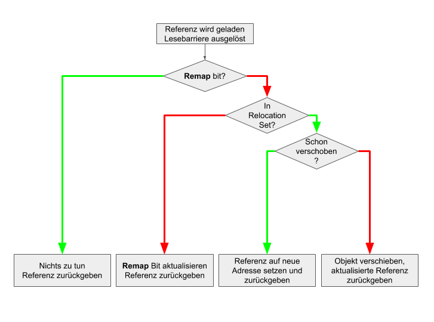
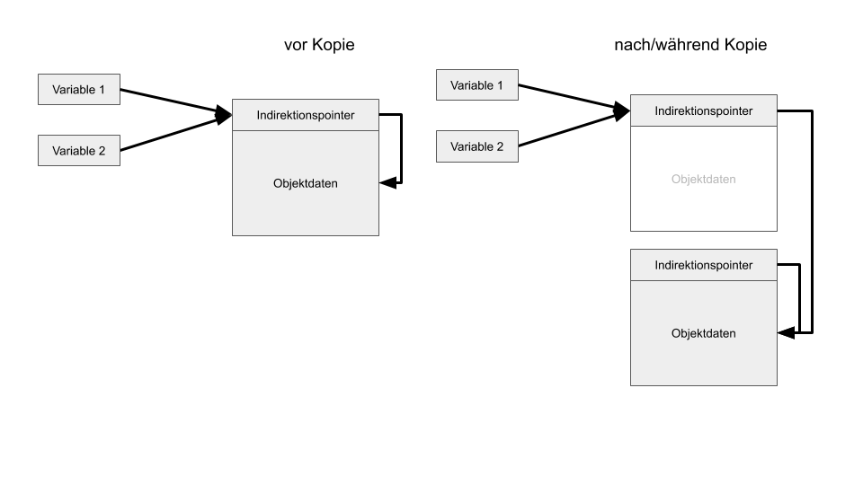

= Im Dutzend billiger - Garbage Kollektoren im Überblick

TODO Aufmacher: ein schönes Bild von Kaffeesatz

image::https://www.bertschi-cafe.ch/webseite/wp-content/uploads/2016/08/Blog-Kaffeesatz.jpg[]

image::https://www.ecooe.com/ecooe-life/wp-content/uploads/2016/11/uses-of-used-coffee-grounds.jpg[]

In Java bewegt sich was! 
Nicht nur die kommenden Sprach-Änderungen, wie Projekte Panama (Native Interface), Loom (Continuations) und Valhalla (Value Types) sind im Kommen. 
Auch die schon beschriebenen Entwicklungen des Graal Compilers und der GraalVM können sich sehen lassen.

Sogar im allseits beliebten Bereich der Garbage Kollektoren hat sich einiges getan.
Daher möchte ich die Gelegenheit nutzen, die Neuankömmlinge kurz vorzustellen und ihre Einsatzbereiche zu erkunden.
Das sind insbesondere ZGC, Shenandoah und Epsilon-GC.

Ich habe in der Vergangenheit über C4 den GC von Azuls Zing und das Java-Memory-Modell berichtet, die existierenden Kollektoren, wie CMS (Concurrent-Mark-Sweep) und G1-GC waren noch kein Thema.

////
Es ist geplant, CMS aus der JVM verschwinden zu lassen, auch wenn einige wenige Anwendungsfälle mit diesem Kollektor besser funktionieren.
G1 ist seit Java 9 der Standard-Kollektor, er wurde über die Jahre immer weiter verbessert, von seinem Ansatz um eine "maximale Pausenzeit" zu garantieren können viele Anwendungen, aber bei weitem nicht alle profitieren.

In den letzten Jahren gab es von einer Reihe von Gruppen neue Forschung und Entwicklung für bessere Garbage Kollektoren.
Besonders, nicht pausierende Kollektoren (pauseless) waren von Interesse.
Desweiteren wurde untersucht, wie Kollektoren für große Speichermengen - Hunderte von Gigabytes bis zu mehreren Terabytes gestaltet werden müssten.

Die hier vorgestellten Kollektoren sind die Ergebnisse der Entwicklung, die es in aktuelle JDKs (11,12,13) geschafft haben.
////

== Was tut ein Garbage Kollektor?

In Java muss man sich glücklicherweise nicht um Speichermanagement kümmern, es sei denn man greift auf Off-Heap Regionen zu.
Objekte können nach Lust und Laune erzeugt werden, der Garbage Kollektor (Müllsammler) kümmert sich um das Aufräumen.

*Wie funktioniert das im Allgemeinen?*

Das Ziel ist, die noch referenzierten (lebendigen) Objekte zu finden und alle anderen freizugeben.
Je nach Kollektor werden dazu dedizierte Regionen (Generations, Pages) des Heap-Speichers mit unterschiedlichen Semantiken genutzt.

Ausgehend von den Objekten die direkt in lokalen Variablen von Threads und statischen Feldern gehalten werden (Wurzel- oder GC-Root-Objekte), kann der Referenzgraph traversiert werden.

Das heisst, ausgehende Referenzen von diesen Startobjekten werden solange transitiv verfolgt, bis es keine neuen Kandidaten gibt.
Dabei wird jedes dieser gefundenen "lebenden" Objekte markiert, um sie später handhaben zu können.

Alle nach dieser Phase nicht markierten Objekte gelten als unerreichbar, oder "tot" und können entfernt werden.
Je nach Kollektor werden entweder die erreichbaren (reachable) Objekte in einen neuen Speicherbereich kopiert, oder der Speicherplatz der unerreichbaren Objekte wird als frei markiert.

Regelmäßig, oder bei Bedarf (Allokationsanfrage für einen größeren Speicherbereich, die nicht mehr erfüllt werden kann) kann Heapspeicher defragmentiert werden.

////
-> Low lantency is not just for HFT, any "interactive" application that wants to support low-latency applications (no long pauses)
-> impacts users and dependent applications (think microservice dependencies), might trigger circuit breakers
-> High throughput is more relevant for long-running processing / batch jobs.
////

Bei der Wahl des Garbage Kollektors sind im Allgemeinen Implementierungen zu bevorzugen, die kurze Pausen und niedrige Latenzen unterstützen.
Die meisten unserer Anwendungen sind interaktiv, d.h. sie bedienen entweder Endanwender oder andere Services, beide Konsumenten können mit Pausen nicht gut umgehen.

Zum Teil kann das sogar zur Auslösung von Resilienzmechanismmen wie Circuit-Breaker, Alarmen, Neustarts usw. führen.
Kollektoren mit höherer Latenz und deutlich höherem Durchsatz sind nur für langlaufende Verarbeitungsprozesse zu empfehlen.
Aber selbst dort können Pausen die parallele Verarbeitung ausbremsen und somit multiplikativ in die Gesamtlaufzeit eingehen.
Durchsatzreduktion kann man mit mehr Resourcen ausgleichen, höhere Latenzen nicht so einfach.

////
=== Phasen

Die typischen Phasen einer Speicherbereinigung sind

1. Finden der Wurzelobjekte
2. Finden der transitiv referenzierten Objekte
3. Markieren der gefundenen, lebendigen Objekte
4. Kopieren oder Verschieben der markierten Objekte
5. Freigabe von Speicherbereichen
6. ggf. Defragmentierung
////

=== Parallel, Concurrent, Inkrementell

Verschiedene Kollektoren unterscheiden sich in ihrer Herangehensweisen, die ich kurz erläutern möchte.

Im einfachsten Fall pausiert der Kollektor einfach das Programm bis seine Arbeit getan ist.
Das führt zu den gefürchteten GC-Pausen, die Anwendungen (Server und Client) einfrieren lassen, was negativ auf das Gesamtverhalten eines Systems wirkt.
Um das zu verhindern bzw. zu minimieren werden verschiedene Mechanismen genutzt.

Die verschiedenen Phasen können in verschiedenen Modi ablaufen:

* *Blockierend:* dazu werden alle Threads der Anwendung angehalten (Stop-The-World, STW), dass kann nur an sicheren Stellen, sogenannten "Safepoints" erfolgen
* *Concurrent:* im Hintergrund, ohne die Anwendung zu pausieren
* *Parallel:* die Phase wird mit mehreren Threads ausgeführt, parallele Verabeitung kann blockieren oder im Hintegrund ablaufen
* *Inkrementell:* Zeitgarantien oder Prioritäten limitieren den Umfang der durchgeführten Arbeit, angefangene Phasen und Operationen können später fortgesetzt werden oder sind auch schon partiell erfolgreich

Es wird versucht blockierende Phasen entweder komplett zu eliminieren oder auf ein absolutes Minimum zu beschränken.

Wenn Phasen im Hintergrund ablaufen (concurrent), sind bestimmte Isolationsmechanismen notwendig da das Java-Program weiterhin Objekte erzeugt und Referenzen aktualisiert.

Zum Beispiel müssen Wurzelobjekte die zu Beginn einer Phase existieren, gefunden werden, dazu ist eine sehr kurze Pause (Stop-the-World) notwendig.
Danach kann das Programm aber weiterlaufen und der Kollektor arbeitet nur auf diesem Set von Wurzelobjekten (und ignoriert neue, die später dazukommen oder handhabt sie separat). 

Je nach Ansatz wird eine Verbesserung von Latenzen meist durch Algorithmen erreicht, die Durchsatzverringerung und höheren Speicherbedarf zu Folge haben. 
Für hohe Parallelität und Hintergrundverarbeitung ist die zusätzliche CPU-Last nicht zu vernachlässigen.

// Trade-offs

////
It’s worth pointing out that all of these properties involve trade-offs. For example, a parallel phase will utilise multiple gc threads to carry out work but in doing so incurs overhead in coordination between the threads. Likewise, a concurrent phase won’t pause application threads but may involve significantly more overhead and complexity to deal with application threads concurrently invalidating its work.

The GC can employ multiple threads while compacting (parallel compaction).
Compaction work can also be split across multiple pauses (incremental compaction).
Compact the heap concurrently to the running application without stopping it (or just for a short time) (concurrent compaction).
No compaction of the heap at all (an approach taken by e.g. Go’s GC).

GC Terminology
To understand where ZGC fits in with the existing collectors and how it can achieve this, we’ll need to go over some terminology first. Garbage Collection at its most basic involves identifying memory that is no longer in use and making it available for re-use. Modern collectors carry out this process in several phases and they tend to be described as follows:

Parallel - while the JVM is running there are application threads and garbage collector threads. A parallel phase is one carried out by multiple gc threads, i.e the work is split up between them. It says nothing about whether the gc threads might be overlapping with running application threads.

Serial - a phase that is serial is only carried out on a single gc thread. As with parallel above, it says nothing about whether the work overlaps with currently running application threads.

Stop The World - in a stop the world phase, the application threads are suspended in order for the gc to carry out its work. When you experience GC pauses this is due to a Stop The World phase.

Concurrent - if a phase is concurrent then the GC can carry out its work at the same time the application threads are progressing with their work. Concurrent phases are complex because they need to be able to deal with application threads potentially invalidating their work before the phase completes.

Incremental - if a phase is incremental then it can run for a period and terminate early due to some condition, e.g time budget or a higher priority gc phase that needs carrying out, while still having done productive work. This is in contrast to a phase that needs to fully complete for it to have been productive.

////

=== Generationale Kollektoren

Viele Kollektoren arbeiten mit verschiedenen Speicherbereichen, für Generationen von Objekten.
Im Ablauf eines Java-Programms sind viele Objekte nur kurzlebig, d.h. sie werden erzeugt, kurz benutzt und wieder freigegeben, z.b. innerhalb einer Methode oder einer Schleife.
Andere Datenstrukturen werden für den gesamten Ablauf des Programms benötigt.

Um diesen verschiedenen Lebenszyklen gerecht zu werden, wird Speicher oft in eine "young" und "old" Generation aufgeteilt, wobei erstere viel kleiner ist (JVM Parameter).
Objekte werden in der young Generation "geboren" und altern dann dort.
Dabei nutzen kopierende GCs noch einmal Subbereiche wie den initialen Eden- und 2 Survivor-Spaces (Überlebende), die es erlauben "lebendige" Objektreferenzen zu kopieren und den gesamten Speicherblock freizugeben.

Nach eine Reihe von GC-Zyklen werden überlebende Objekte berentet (tenured) und wandern in die "old Generation".

// TODO Bild

Je nach Generation werden unterschiedliche Ansätze für die Bearbeitung der verschiedenen Regionen benutzt.
Zum Beispiel werden in G1 die Überlebenden der jungen Generation mit einer blockierenden Phase in einen der Survivor Bereiche kopiert.

Andere Ansätze nutzen (zusätzlich) Speicherseiten einer gewissen Größe als Strukturierungsmechanismen, dann werden immer komplette Seiten bereinigt, meist nach minimalem Füllgrad von aktiven Objekten priorisiert.

////
=== GC Interface (JEP 304)

// The GC interface (JEP 304) was integrated in JDK 11, and many extensions and improvements have been made to the GC interface since.
Seit JDK 11 gibt es eine explizite API für Garbage Kollektoren, die alle hier erwähnten Beispiele nutzen.
Dazu wurde die Hotspot JVM Implementierung refaktoriert, so dass Kollektoren fast ausschliesslich in unabhängigen, separaten Quellcodemodulen residieren können.

In dem neuen API müssen Kollektoren die `CollectedHeap` Superklasse implementieren, sowie saubere Implementierungen für
Speicherbarrieren (`BarrierSet` - Lesen und Schreiben) in den JIT-Kompilern und dem Interpreter (`CollectorPolicy`,`GCInterpreter/C1/C2Support`), sowie Diagnostikmechanismen (`MemoryService`) bereitstellen.
Bisher war dieser Code über weite Teile des JVM Quellcodes verstreut.

////

== ZGC

ZGC, ein paralleler Kollektor der im Hintegrund (concurrent) arbeitet, wurde von Per Linden entwickelt und von Oracle seit OpenJDK 11 als Open-Source veröffentlicht.
Wie bei G1 ist der Fokus von ZGC die Reduktion von Pausen während des Aufräumens bei minimalem Einfluss auf den Durchsatz.
// Daher wird die Defragmentierung (Compaction), also das Zusammenkopieren von Speicherbereichen im Hintergrund (concurrent, parallel) ausgeführt.

ZGC nutzt keine festen Generationen, sondern sogenannte *ZPages* (klein: 2MB, mittel: 32MB, gross: N*2MB), die dynamisch erzeugt werden können.
Um Defragmentierungsproblemen vorzubeugen (und für andere Tricks), arbeitet ZGC mit virtuellen Speicheraddressen, so dass große Objekte auch angelegt werden können, wenn der physische Speicher zu fragmentiert ist.

.Speicherseiten von ZGC
image::https://packt-type-cloud.s3.amazonaws.com/uploads/sites/3711/2019/06/0d70cc34-51c5-4b8e-adeb-29468e7d2910.png[width=400]

Weil das Programm während der Bereinigung weiterläuft, muss es eine Möglichkeit geben, die Referenzen die gerade verschoben werden, immer sauber aufzulösen.
Das geschieht mit einer Indirektion beim Lesen von Adressen (nur für Objektreferenzen nicht für primitive Werte), eine Lesebarriere.
// Lesezugriff auf Speicher erfolgt fast ununterbrochen in Programmen, daher muss so eine Indirektion extrem effizient umgesetzt werden.

Wie auch C4 speichert ZGC Zusatzinformationen (Koloration) zum Status (`finalizable, remap, mark0, mark1`) einer Referenz in 4 der 22 höherwertigen, reservierten Bits einer 64-Bit Adresse.
// Diese müssen beim eigentlichen Speicherzugriff mit zusätzlicher Maskierung wieder herausgefiltert werden.
Das lässt 42 Bits für die eigentliche Speicheraddressierung, was für _nur_ 4TB reicht.
// Diese angereicherten (kolorierten) virtuellen Addressen stellen 4 zusätzliche Addressräume dar, die auf den realen Speicher gemappt werden.

////
Die  Referenzen im virtuellen Speicher werden vom Betriebssystem in den echten Speicher gemappt, dabei können mehrere virtuelle Speicherbereiche auf einen physikalischen Speicherbereich abgebildet werden.
Mit den genannten 4 Bits von denen jeweils nur eines auf 1 gesetzt sein kann, können somit 4 virtuelle Views des Speichers genutzt werden.
////

Beim Lesen einer Heap-Referenz werden die zusätzlichen Bits getested und falls gesetzt je nach aktueller Kollektor-Phase Speicheroperationen ausgeführt.
Danach wird die maskierte, gelesene (oder aktualisierte) Addresse an den Konsumenten in der JVM übergeben.

.Phasen von ZGC
. Sehr kurze Pause um Wurzelobjekte zu bestimmen (Live-Set)
. Traversierung und Markierung im Hintergrund, Ladebarriere sorgt für ggf. notwendige Markierung.
. Sehr kurze Pause zur Nachbearbeitung.
. Verschiebung aktiver Objekte.
.. Speicherseiten mit Minimalzahl aktiver Objekten zum Verschieben auswählen.
.. Kurze Pause um GC-Roots in diesen Seiten zu verschieben.
.. Verschiebung im Hintegrund, Ladebarriere kann wenn notwendig Verschiebung im Anwendungsthread auslösen (siehe Abb.)
. Referenzen die noch auf alte Speicheradressen zeigen, werden in der nächsten Markerungsphase aktualisiert.

.Auswertung Ladebarriere während des Verschiebens

Die Pausenzeiten (STW) des ZGC werden nur von der Größe des relativ kleinen Live-Sets der Wurzelobjekte bestimmt und sind daher minimal.
Dieses Set wächst auch nicht linear mit der Heapgröße, da die initialen Einstiegspunkte meist nur auf größere Objektgraphen zeigen.

Der ZGC kann mittels `-XX:+UnlockExperimentalVMOptions -XX:+UseZGC` ab Java 11 aktiviert werden.

// Tuning: -XX:ConcGCThreads=
// -XX:+UseLargePages
// -XX:+UseTransparentHugePage
// ZGC is a NUMA-aware GC. Applications executing on the NUMA machine can result in a noticeable performance gain. -XX:+UseNUMA

////
- reduce pause times -> not throughput
- heap compaction

ZGC uses concurrent compaction to keep pauses to a minimum, this is certainly not obvious to implement so I want to describe how this works. Why is this complicated?

You need to copy an object to another memory address, at the same time another thread could read from or write into the old object.
If copying succeeded there might still be arbitrary many references somewhere in the heap to the old object address that need to be updated to the new address.
////

Die Mechanismen für ZGC ermöglichen interessante zukünftige Entwicklungen, wie Speicherbereiche auf verschiedenen Medien (DRAM, NVMe, MRAM).

== Shenandoah

Shenandoah (von RedHat) ist ebenfalls ein ein experimenteller Kollektor mit deterministischen, minimalen Pausen unabhängig von der Heapgröße, der seit JDK 12 verfügbar ist.
Damit werden ähnliche Ziele verfolgt wie bei ZGC, nur mit anderen Mitteln.
Shenandoah basiert auf ähnlichen Konzepten, Regionen und Phasen wie G1, nur wird die JVM für die Speicherbereinigung nicht pausiert.
Nur das initiale Finden der Ausgangsobjekte pausiert Threads, diese Unterbrechungen sind aber nur sehr kurz.

Es werden keine Generationen genutzt, daher müssen in jedem GC-Zyklus alle noch aktiven Objekte markiert werden.
Dafür kann Shenandoah besser mit Systemen umgehen, bei denen der generationale Ansatz nicht trägt, z.b. mit nur langlebigen oder vielen "mittelalten" Objekten.

// based on G1? 
Genau wie C4 in Azul's Zing VM nutzt Shenandoah Indirektionen für Objektpointer ("Brooks Pointer"), um Speicher-Defragmentierung (Compaction) und Markierung von aktiven Referenzen im Hintergrund auszuführen.
Beim Kopieren aktiver Objekte wird dieser Pointer auf die neue Objektadresse umgelenkt (siehe Abb.).
Die Dereferenzierung des vor dem Objektheader liegenden Pointers, kostet die Anwendung zusätzliche Zeit, Speicher und Durchsatz.

.Objektpointer in Shenandoah

// TODO Bild

// Alle Schreiboperationen (auch primitive Werte) müssen mit Barrieren geschützt werden, um ggf. einschreiten zu können.
// während des Aufräumens führen Schreiboperationen zum Anlegen der Kopie mit Indirektion, Schreibkonflikte werden (Pointer hat schon Indirektion) abgebrochen.

// todo Garbage First collection set for compaction -> evacuate to new region
// 1 read barrier (brooks pointer), 4 write barriers

////
TODO Phases as image

Phasen von Shenandoah:

. Initiale Markierung der Root Objekte (STW)
. Markierung der Objektgraphen im Hintergrund
. 
. 
// Initial Marking (STW) • Concurrent Marking • Final Remark (STW) • Concurrent Cleanup • Concurrent Evacuation • Init Update References (STW) • Concurrent Update References • Final Update References (STW) • Concurrent Cleanup
////

Für die Ausnahmefälle, wenn Objekte während der Hintergrundverarbeitung erzeugt bzw. zugewiesen werden, gibt es eine Schreibe-Barriere und Koordination zwischen den Kollektor- und Allokations-/Update-Threads.

Während Leseoperationen durch die Indirektion transparent auf das bewegte Objekt ausgeführt werden, landen Aktualisierungen gleich im neuen Speicherbereich.

Hohe Allokationsraten können die Freigabegeschwindigkeit des Kollektors überschreiten, das ist ein bekanntes und dokumentiertes Problem von Shenandoah.
Der Kollektor versucht dem mit künstlichen Pausen in individuellen Allokationsthreads (_pacing_) entgegenzuwirken.
Und wenn das nicht reicht, gibt es am Ende der GC-Phase eine längere Pause (_degenerated mode_), die Objekte aufräumt, die der Kollektor nicht mehr geschafft hat.

Die Aktivierung von Shenandoah erfolgt mittels: `-XX:+UnlockExperimentalVMOptions -XX:+UseShenandoahGC`

Shenandoah nutzt Heuristiken für die Häufigkeit der Kollektionsdurchführung (`-XX:ShenandoahGCHeuristics=`).
Im standardmässigen, `adaptive` Modus wird die in den ersten paar Minuten nach dem Programmstart gemessene Allokationsrate genutzt.
Man kann aber auch eine Speichergrenze für `static` angeben, oder den Kollektor kontinuierlich mittels `compact` laufen lassen.

Die GC-Logs von Shenandoah sind leicht verständlich, nach Abschluss des Prozesses wird noch eine detaillierte Statistik ausgegeben.
// todo?
// Referenzverarbeitung und Java Synchronisation kann Einfluss auf die Dauer der Pausen haben, genau wie die Anzahl der verfügbaren Threads für die Hintergrundverarbeitung.

// classloader leak (reflection callsite inflation)
// Degrading performance due to class unloading can be addressed by -XX:+ClassUnloadingWithConcurrentMark. We're working on concurrent class unloading and weak reference processing right now.

// The GC logs are also very informative, and there is an extra 
// killer feature — once the application shuts down, Shenandoah prints into the GC log a very detailed table describing how much time each phase of the GC cycle took. 

// Failure modes: degenerate GC, pacing, full-gc

////
- paper: https://www.researchgate.net/publication/306112816_Shenandoah_An_open-source_concurrent_compacting_garbage_collector_for_OpenJDK

- concurrent evacuation
- trades concurrent cpu cycles and space for pause time improvements.
- indirection pointer to every Java object which enables the GC threads to compact the heap while the Java threads are running
- Marking and compacting are performed concurrently so 
- we only need to pause the Java threads long enough to scan the thread stacks to find and update the roots of the object
- responsiveness and predictable short pauses. 
- Pause times due to reasons other than GC like Time To Safe Point (TTSP) issues or monitor inflation are outside the scope of this JEP.

Non-generational (still option for partial collection) 
• Region based 
• Use Read Barrier: Brooks pointer 
• Self-Healing 
• Cooperation between mutator threads & GC threads 
• Only for concurrent compaction 
• Mostly based on G1 but with concurrent compaction Shenandoah GC
////

== Epsilon GC

Aleksey Shipilëv, von dem wir schon des öfteren gehört haben, hatte den Epsilon GC ursprünglich nur als Scherz und Demonstration eines minimalen Kollektors entwickelt, der einfach "nichts macht".
Damit entfällt natürlich auch der ganze Overhead der Phasen und die ggf. vorgenommenen (aber unnötigen) Pausen bei existierenden Kollektoren.
Auch die Lese- oder Schreibbarrieren anderer GCs sind hier nicht notwendig.

Der Nachteil ist offensichtlich: Da kein Speicher freigegeben wird, ist irgendwann Schluss.
Dann beendet sich der Prozess mit einem `OutOfMemoryError`.

Das kann z.B. nützlich sein, um die garantierte maximaln Speicherallokation bestimmter Module oder Funktionalitäten zu testen.
Indem man den Epsilon-GC mit dieser Maximalangabe konfiguriert und Tests ausgeführt, die alle nicht in einem Allokationsfehler enden dürfen.

Interessanterweise gibt es eine Reihe von Anwendungen die von so einem Verhalten profitieren können.
Wie schon vor einigen Jahren in der LMAX-Disruptor Kolumne erläutert, können Anwendungen die hohe Durchsätze mit minimalen Latenzen (z.b. im Börsenumfeld oder für Sensorauswertungen) keine GC-Pausen tolerieren.
Daher wird in diesen Anwendungen auch heute schon oft darauf hingezielt zur Laufzeit keine Objekterzeugung vorzunehmen.
*Alle* Datenstrukturen sind voralloziert, es werden nur primitive Werte geschrieben und gelesen.

Mit Epsilon-GC, verfügbar seit Java 11, werden solche Low-Latency Anwendungen noch weiter beschleunigt.

Für eine Reihe von Systemen ist das auch weniger ein Problem als man erst einmal annehmen würde.
Wie kurzlebige Kommandozeilen-Kommandos, zustandslose Verarbeitungsprozesse, Microservices, serverlose Funktionen (FaaS), die entweder von einem Neustart nicht beeinträchtigt werden, oder bei denen Neustarts Teil des kontinuierlichen Betriebs - Autoskalierung, Resilienztests usw. sind.

Epsilon GC wird auch genutzt, um minimale Latenzen für das GC Verhalten der JVM herauszufinden und das JVM-GC API (JEP-304) zu validieren.

`-XX:+UnlockExperimentalVMOptions -XX:+UseEpsilonGC`

Das Java Team selbst rät davon ab, diesen Kollektor in Produktion einzusetzen, wenn man nicht genau weiss was man tut.

// For ultra-latency-sensitive applications, where developers are conscious about memory allocations and know the application memory footprint exactly, or even have (almost) completely garbage-free applications, accepting the GC cycle might be a design issue.

// In einem Vortrag [Shipilëv] stellt er vor, wie man einen Kollektor selbst schreiben kann.

////

== Tests

Für meine Tests habe ich einen kleinen JMH Benchmark aufgesetzt, der auf einem grossen Heap (500G) aktiv viele Objekte erzeugt.

TODO Dazu wird am Anfang ein grosser Text eingelesen, der dann parallel in Worte gesplittet und deren Häufigkeit gezählt wird.
Da aber die Gesamtmenge des genutzten Speichers durch die Textgröße begrenzt ist, kann auch das Verhalten von Epsilon-GC untersucht werden.

@State(Scope.Thread)
public class GCTextTest {

    @Benchmark
    @BenchmarkMode(Mode.AverageTime)
    @OutputTimeUnit(TimeUnit.MICROSECONDS)
    public void testMethod(Blackhole bh) {
	   	   var counts = 
		   Files.lines(Paths.get(args[0])).parallel().
		   .flatMap(s -> Arrays.stream(s.split("\s+")))
		   .collect(Collectors.toConcurrentMap(w -> w, w -> 1, Integer::sum));
		   bh.consume(counts);
   }
}

////
== Fazit

Man sieht dass zum einen Garbage Kollektion noch kein abschliessend behandeltes Thema ist, es gibt Neu- und Weiterentwicklungen, die insbesondere auf größere Heaps und minimale Pausenzeiten ausgelegt sind.
Die hier vorgestellten Kollektoren sind alle noch experimentell aber für ihre geplanten Einsatzgebiete schon gut nutzbar.

Moderne Kollektoren kommen fast ohne Tuning aus, das einzige was normalerweise gesetzt werden muss ist die maximale Heapgröße `-Xmx`.

Am besten ist natürlich, eigene Anwendungsfälle und Szenarien zu testen.
Dabei beim Messen besonders auch auf die 99% Perzentilen der Latenz zu schauen und CPU-Last und Durchsatz beachten.

== Referenzen

* Understanding Low Latency JVM GCs https://www.slideshare.net/JeanPhilippeBEMPEL/understanding-low-latency-jvm-gcs
* ZGC: https://dinfuehr.github.io/blog/a-first-look-into-zgc/
* ZGC Tutorial: https://hub.packtpub.com/getting-started-with-z-garbage-collectorzgc-in-java-11-tutorial/
* Shenandoah: https://developers.redhat.com/blog/2019/06/27/shenandoah-gc-in-jdk-13-part-1-load-reference-barriers/
* Shenandoah Praxisbericht: http://clojure-goes-fast.com/blog/shenandoah-in-production/
* Epsilon GC: https://blogs.oracle.com/javamagazine/epsilon-the-jdks-do-nothing-garbage-collector

////
concurrent marking - tri color

new allocations - mark at allocation or ignore for current cycle
misses - unreferenced objects newly stored in safe (done) objects
- handle misses: snapshot at beginning, incremental updates
////

////
https://openjdk.java.net/jeps/318
https://www.opsian.com/blog/javas-new-zgc-is-very-exciting/
https://blog.plan99.net/modern-garbage-collection-part-2-1c88847abcfd
https://dzone.com/articles/java-garbage-collection-3
ZGC Video: https://www.youtube.com/watch?v=kF_r3GE3zOo
https://dinfuehr.github.io/blog/a-first-look-into-zgc/
https://www.slideshare.net/jelastic/choosing-right-garbage-collector-to-increase-efficiency-of-java-memory-usage
https://community.atlassian.com/t5/Data-Center-articles/Which-GC-Garbage-Collection-strategy-do-you-prefer-for-your-app/ba-p/1052212
http://clojure-goes-fast.com/blog/shenandoah-in-production/
https://wiki.openjdk.java.net/display/shenandoah/Main
https://www.slideshare.net/JeanPhilippeBEMPEL/understanding-low-latency-jvm-gcs-170667679
https://www.slideshare.net/RedHatDevelopers/shenandoah-gc-java-without-the-garbage-collection-hiccups-christine-flood
ZGC https://openjdk.java.net/jeps/333
GC Interface https://openjdk.java.net/jeps/304

////