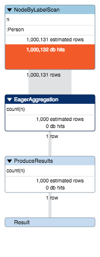

= Quick Node by Label Counts in Neo4j 2.x and 3.x

Oftentimes you want to know how many nodes of a certain labe live in your Neo4j database.

Usually you run a statement like this:

[source,cypher]
----
MATCH (n:Person) RETURN count(n);
+----------+
| count(n) |
+----------+
| 1000131  |
+----------+
1 row
2336 ms
----

Which after 2-3 seconds tells us that there are 1M `:Person` nodes in our database.

Since version 2.x, Neo4j contains a transactional store for database statistics, which is used for estimation of our COST based planner.

One thing this store keeps track of is the number of nodes per label. 
And it does so in a transactionally safe way.
Other things that are kept track of are selectivity of properties and indexes / constrains as well as degree distribution per relationship-type and direction between two labels.

This store is used in Neo4j 3.x where the above query returns as fast as *1ms*.

----
MATCH (n:Person) RETURN count(n);
+----------+
| count(n) |
+----------+
| 1000131  |
+----------+
1 row
1 ms
----

You poor souls on Neo4j 2.x don't have to despair.
As mentioned above this count-store is used for query planning by the COST planner.

Fortunately we can access the query plan (that you've often seen so nicely rendered) information as JSON response of a query prefixed with `EXPLAIN`.

You see it when you execute this HTTP post in your browser.

----
:POST /db/data/transaction/commit {"statements":[{"statement":"explain MATCH (n:Person) RETURN count(n)"}]}

{
  "results": [
    {
      "columns": [],
      "data": [],
      "plan": {
        "root": {
          "operatorType": "ProduceResults",
          "runtime-impl": "INTERPRETED",
          "planner-impl": "IDP",
          "version": "CYPHER 2.3",
          "KeyNames": "count(n)",
          "EstimatedRows": 1000.0654978550155,
          "planner": "COST",
          "runtime": "INTERPRETED",
          "identifiers": [
            "count(n)"
          ],
          "children": [
            {
              "operatorType": "EagerAggregation",
              "KeyNames": "",
              "EstimatedRows": 1000.0654978550155,
              "identifiers": [
                "count(n)"
              ],
              "children": [
                {
                  "operatorType": "NodeByLabelScan",
                  "LabelName": ":Person",

                  "EstimatedRows": 1000131, <1>

                  "identifiers": [
                    "n"
                  ],
                  "children": []
                }
              ]
            }
          ]
        }
      }
    }
  ],
  "errors": []
}
----
<1> Then the "EstimatedRows" number of the `NodeByLabelScan` operation is the value that comes from the count-store.

So to extract the data we only have to access the JSON and for that we us our trusted friend and companion `jq` to reach into the JSON and extract the numeric value.

Which we can do with: `jq .results[0].plan.root.children[0].children[0].EstimatedRows`.

So we can run a simple curl command to get the JSON and return the number of nodes with that label even in Neo4j 2.x.

----
time curl -s -u neo4j:test -H content-type:application/json \
      http://localhost:7474/db/data/transaction/commit \
     -d'{"statements":[{"statement":"explain MATCH (n:Person) RETURN count(n)"}]}' | \
     jq .results[0].plan.root.children[0].children[0].EstimatedRows

# 1000131
----
