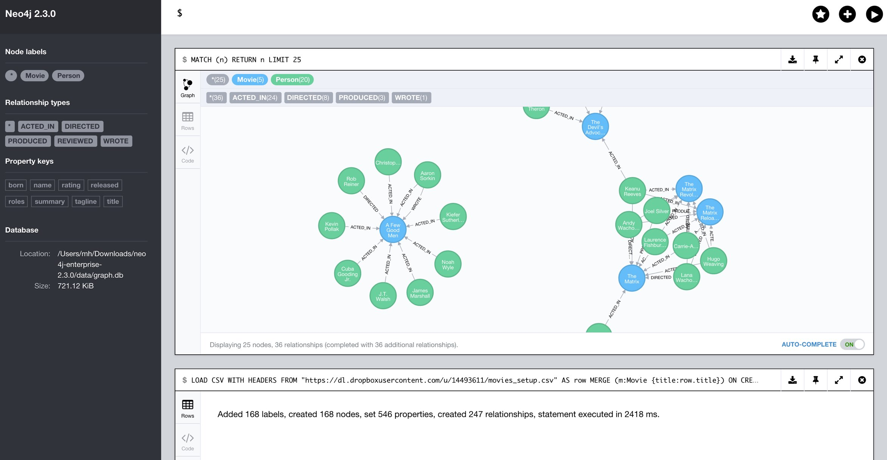

= Quick Neo4j Export - Import Roundtrip via CSV

I just quickly want to show how to roundtrip an export of a small Neo4j database using Neo4j-Browser and Cypher.

== Setup
We use the movie example data-set. Just run `:play movies` in your browser and insert the data.

== Export

Then to export the CSV run this statement which returns the graph structure as tabular result, exporting one relationship-pair from person to movie per row.

For your own export you would have to adapt the statement.

[source,cypher]
----
MATCH (p:Person)-[r]->(m:Movie)
return p.name as name, p.born as born, 
       type(r) as type, reduce(a="", r in r.roles | a + r + ";") as roles, 
       m.title as title, m.released as released, m.tagline as tagline
----

Please note that I export each property as a single column, we don't need to export the labels of the nodes here, as they are fixed.
If you have a variable dataset, you might want to export the labels of a node as a separate column.
The roles are a string array, which we turn into a semicolon-separated string in one column.

Using the download icon, you can download the results as as CSV, which you can store locally or a accessible HTTP-URL.

In my case I put it on DropBox: https://dl.dropboxusercontent.com/u/14493611/movies_setup.csv

== Import

To import the data again, we use LOAD CSV.
We merge the nodes on their primary key, here it is `:Movie(title)` and `:Person(name)`.

To ensure performant loading and avoiding duplicates it is recommended to create a unique constraint upfront:

[source,cypher]
----
CREATE CONSTRAINT ON (p:Person) ASSERT p.name IS UNIQUE;
CREATE CONSTRAINT ON (m:Movie)  ASSERT m.title IS UNIQUE;
----

When merging nodes on their primary keys, we only have to set the other properties once, when they are first created.
Due to the output of pairs, each node might appear multiple times, so MERGE guarantees uniqueness.

Unfortunately there is currently no means to dynamically determine labels and relationship-types from input data, so we have to resort to a trick.

We use a conditional within FOREACH to create an one-element or empty collection if a certain conditions is met, so that the operation within is executed or not.

[source,cypher]
----
LOAD CSV WITH HEADERS FROM "https://dl.dropboxusercontent.com/u/14493611/movies_setup.csv" AS row
MERGE (m:Movie {title:row.title}) ON CREATE SET m.tagline = row.tagline,m.released=row.released
MERGE (p:Person {name:row.name}) ON CREATE SET p.born = row.born
FOREACH (_ in CASE row.type WHEN "ACTED_IN" then [1] else [] end |
   MERGE (p)-[r:ACTED_IN]->(m) ON CREATE SET r.roles = split(row.roles,";")[0..-1]
)
FOREACH (_ in CASE row.type WHEN "DIRECTED" then [1] else [] end | MERGE (p)-[:DIRECTED]->(m))
FOREACH (_ in CASE row.type WHEN "PRODUCED" then [1] else [] end | MERGE (p)-[:PRODUCED]->(m))
FOREACH (_ in CASE row.type WHEN "WROTE"    then [1] else [] end | MERGE (p)-[:WROTE]->(m))
FOREACH (_ in CASE row.type WHEN "REVIEWED" then [1] else [] end | MERGE (p)-[:REVIEWED]->(m))
----

