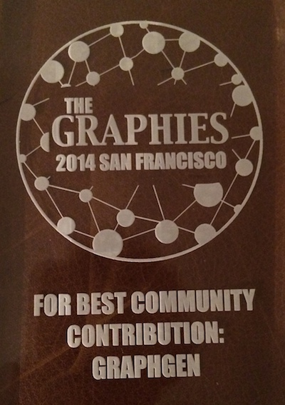

== The Story of GraphGen

This is the story behind the really useful and ingenious http://neo4j.com[Neo4j] example graph data generator developed by http://twitter.com/ikwattro[Christophe Willemsen].

I don't just want to show you the tool but also tell the story how it came to be.

*First of all: The Neo4j Community is awesome.* +
There are so many enthusiastic and creative people, that it is often humbling for me to be part of it.

So October 1st, Christophe tweeted out a short screencast he recorded, about a new tool (NeoGen) he was developing which converted a YAML domain specification into Cypher statements to populate a Neo4j database.

++++
<blockquote class="twitter-tweet" lang="en">
Just released a <a href="https://twitter.com/hashtag/neo4j?src=hash">#neo4j</a> graph generator <a href="https://t.co/7EDLQcwSuE">https://t.co/7EDLQcwSuE</a> sample video : <a href="https://t.co/ErDwl20pO2">https://t.co/ErDwl20pO2</a> <a href="https://twitter.com/hashtag/graphs?src=hash">#graphs</a> <a href="https://twitter.com/hashtag/draft?src=hash">#draft</a> feedbks|reqs welcome
&mdash; Christophe Willemsen (@ikwattro) <a href="https://twitter.com/ikwattro/status/517302896707534848">October 1, 2014</a></blockquote>

++++

It was already pretty cool, but being me, I had a bulk of ideas that I'd love to see in such a tool.

Some of these were:

* online tool
* visualization
* cypher like specification language (inspired by http://yuml.me[yuml.me])
* download cypher script and GraphJSON for later usage
* populate Neo4j database from online tool
* generate Neo4j console link

So I contacted him and we had some really good discussions.
He was very enthusiastic and eager to continue to work on this.
So he first added the https://twitter.com/ikwattro/status/518042994277384192[Cypher spec], then the https://twitter.com/ikwattro/status/519927723171782656[online tool GraphGen] including visualization, the download of https://twitter.com/ikwattro/status/519964348358598656[GraphJSON] & https://twitter.com/ikwattro/status/519990567737245697x[Cypher] and finally the https://twitter.com/ikwattro/status/520516549904715777[database population].
And he continued further and further adding model types (pre-defined combinations of labels with properties) and adding the Neo4j console link. All while expanding the documentation.

Really impressive work.

Christophe also added some http://graphgen.neoxygen.io/documentation[documentation] and a neat teaser to quickly get started.

image::https://pbs.twimg.com/media/BzrUpthIQAA-Bl7.png:large[width=500,link=http://graphgen.neoxygen.io/]

And so today, *a mere 5 days later*, http://graphgen.neoxygen.io/[GraphGen] was out there, very usable and useful and waiting for you to generate *your graph domain model*.

No wonder he won the 2014 GraphConnect Graphies Award for best community contribution.

Here is a quick screencast I made (which is already superceded by new features):

++++
<iframe width="560" height="315" style="margin:1em;" src="//www.youtube.com/embed/3ZXOuiVaaOU" frameborder="10" allowfullscreen></iframe>
++++

****
The web-based GraphGen tool is of course on https://github.com/neoxygen/graphgen[GitHub] too.
Here is a quick explanation on how it works internally:

1. Rendering your Cypher-Spec statement colorfully with http://codemirror.net/mode/cypher/index.html[CodeMirror Cypher highlighting]
2. The PHP backend parses the Cypher statement and generates and intermediate model, which is the same as from the YAML input
3. then generates the graph model internally according to the counts, cardinalities and property types you provided
4. the property values are created using the https://github.com/fzaninotto/Faker#formatters[Faker library] to generate realistic data for names, dates, creditcards etc.
5. then it generates Cypher Statements (CREATE, MERGE, MATCH) to generate your data and http://graphjson.io[GraphJSON]
6. the cypher and GraphJSON are made available for download and the GraphJSON is also used to render a visualization of your graph with http://graphalchemist.github.io/Alchemy[Alchemy.js]
7. you can open a new, shared Neo4j console link which is generated using its API
8. if you choose to, a publicly available Neo4j database can be populated with the graph model by posting Cypher statements to the http://docs.neo4j.org/chunked/milestone/rest-api-transactional.html[transactional HTTP endpoint] using Ajax requests
****

In a http://neo4j.com/blog/graphgen-creation-implementation/[recent blog post] Christophe wrote about his view of this story.

And my amazing colleague Rik showed how to utilize GraphGen in his http://blog.bruggen.com/2014/10/simulating-idms-empdemo-using-graphgen.html[Simulating the IDMS EmpDemo] blog post.

This is just one of the many examples in which a member of the Neo4j community got behind a good idea and created a very useful tool, driver, framework or documentation.

I can't thank all the contributors enough and can only pledge to support the community to the best of my abilities.

I want to invite you all to join our community and contribute in writing and coding around Neo4j and be supported by others when you need it.

And even if you don't have an idea that you currently want to pursue, just helping others by answering questions and providing feedback to Neo4j and all the tools and content in its ecosystem is extremely valuable and helpful. 

Cheers, Michael 

P.S: Christophe is also the author of the more widely used Neo4j PHP library https://github.com/neoxygen/neo4j-neoclient[NeoClient], translator of the http://docs.neo4j.org/lab/manual-french/[Neo4j manual into French] and importer of https://twitter.com/ikwattro/status/500417925627785217[GitHub repository data] into Neo4j.

Meet him and me in London for the http://www.eventbrite.com/e/neo4j-graphday-london-tickets-13129289057[GraphDay on Nov 13] and the http://www.meetup.com/graphdb-london/events/216099452/[GraphHack - Meetup on Nov 12].