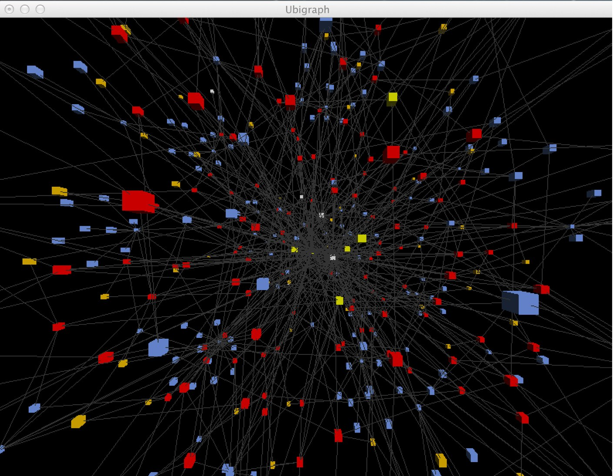

== Rendering a Neo4j Graph in UbiGraph

I never heard of UbiGraph before, but this tweet by https://twitter.com/a61dr41n[@a61dr41n] made me curious.

++++
<blockquote class="twitter-tweet" lang="en">
<a href="https://twitter.com/search?q=%23ubigraph&amp;src=hash">#ubigraph</a> is an excellent <a href="https://twitter.com/search?q=%23visualisation&amp;src=hash">#visualisation</a> package for <a href="https://twitter.com/search?q=%23neo4j&amp;src=hash">#neo4j</a> and other <a href="https://twitter.com/search?q=%23GraphDB&amp;src=hash">#GraphDB</a> can&#39;t believe I haven&#39;t heard of it sooner...
&mdash; a61dr41n (@a61dr41n) <a href="https://twitter.com/a61dr41n/statuses/479815785288695808">June 20, 2014</a></blockquote>

++++

So I checked it out. UbiGraph is a graph rendering server that is controlled remotely and also interactively with a XML-RPC API (which is a weird choice). 
It comes with example clients in Java, Python, Ruby and C. 
You can http://ubietylab.net/ubigraph/content/Downloads/index.php[download it from here]. After unzipping the file and starting +bin/ubigraph_server &+, you should see a black window rendering the void, waiting for your commands.

You can run the Python example with +python lang/Python/example.py+, you should run the other examples as well, just for fun. The Python example collection is most comprehensive.

In general the API is pretty straightforward, there is also a https://dl.dropboxusercontent.com/u/14493611/QuickReference.pdf[PDF refcard] in the download.

* +new_vertex(), new_vertex_w_id(id)+ create a node
* +new_edge(from,to)+ create a relationship
* +set_[vertex|edge]_attribute(id,attribute,value)+ style a node or relationship
* style attributes can be +shape+ (sphere,cone,box,...), +size+ (a value around 1.0), +color+ (hex), +label+, +visible+ additionally for relationships +spline+,+oriented+,+stroke+,+width+ and more
* +new_[vertex|edge]_style(parent_style)+ create a new global style with attributes, inheriting from a parent, or root (parent-id 0)
* +change_[vertex|edge]_style(id,style)+ assign style to node or relationship

I show how to access UbiGraph from Java, but it is of course much simpler in Ruby with http://github.com/maxdemarzi/neography[neography] or in Python using http://py2neo.org/[py2neo].

Rendering Neo4j is pretty straightforward:

1. we just connect to Neo4j,
2. run a cypher query to return the graph structure and 
3. send it to UbiGraph using the API outlined above.

UbiGraph comes with a Java connector in +UbigraphClient.java+ with the mentioned API methods. It uses the Apache XmlRpc library, which you can pull in via https://github.com/jexp/neo4j-ubigraph/blob/master/pom.xml#L18[Maven] or http://archive.apache.org/dist/ws/xmlrpc/apache-xmlrpc-current-bin.tar.bz2[download here] (the official links are broken).

Here is a minimal query that only loads the structure without any further information. You could choose to load the additional information using the interactive features of UbiGraph, 
which I don't cover here.

[source,cypher]
----
MATCH (n)-->(m) 
RETURN id(n) as start_id, id(m) as end_id
----

I used more detailed graph information from the beginning. This cypher query is broader, it loads nodes, their relationships to other nodes (if any) and meta-data like id's labels and relationship-types.

[source,cypher]
----
MATCH (n) 
OPTIONAL MATCH (n)-[r]->(m) 
RETURN 
 id(n) as start_id, head(labels(n)) as start_label, n as start_properties, 
 id(m) as end_id, head(labels(m)) as end_label, m as end_properties, 
 id(r) as rel_id, type(r) as rel_type, r as rel_properties 
 LIMIT 1000
----

For connecting to Neo4j I used the http://www.neo4j.org/develop/tools/jdbc[Neo4j-JDBC driver], but you can use any connector or client driver, or even a https://github.com/neo4j-contrib/cypher-http-examples[few lines of code with a http-client-library] to run a Cypher query against Neo4j.

So what we do was:

1. Connect to Neo4j via JDBC
2. Create a connection, statement, provide a parameter for the limit and execute the query
3. Iterate over the resultset and 
4. for each returned row create the UbiGraph nodes and relationships (as we provide id's no duplicates will be created)
5. from the first label and given shape we create styles that we attach to each created node

[source,java]
----
public static final String ALL_NODES_QUERY =
        "MATCH (n) " +
                "OPTIONAL MATCH (n)-[r]->(m) " +
                "RETURN " +
                " id(n) as start_id, labels(n) as start_labels, n as start_properties, " +
                " id(m) as end_id, labels(m) as end_labels, m as end_properties, " +
                " id(r) as rel_id, type(r) as rel_type, r as rel_properties " +
                "LIMIT {1}";

private static void renderNeo4jGraph(UbigraphClient graph, String url, int limit) throws SQLException {
    Connection connection = DriverManager.getConnection(url);
    try (PreparedStatement stmt = connection.prepareStatement(ALL_NODES_QUERY)) {
        stmt.setInt(1, limit);
        try (ResultSet rs = stmt.executeQuery()) {
            while (rs.next()) {
                createUbiVertex(rs, "start", graph, false);
                createUbiVertex(rs, "end", graph, false);
                createUbiEdge(rs, "start_id", "end_id", "rel", graph);
            }
        }
    }
}
----

Creating a node and relationship with the UbigraphClient is pretty straightforward. The styling is a bit more involved.

[source,java]
----
private static int createUbiVertex(ResultSet rs, String prefix, UbigraphClient graph, boolean renderProps) throws SQLException {
    int id = rs.getInt(prefix + "_id");
    String label = label((Collection<String>) rs.getObject(prefix + "_labels"));
    Map props = renderProps ? (Map) rs.getObject(prefix + "_properties") : null;

    int success = graph.newVertex(id);
    if (success==-1) return success;
    if (label!=null) graph.changeVertexStyle(id, style(graph, label));
    if (props != null && props.containsKey("name") && asList("Player", "Country", "WorldCup").contains(label)) {
        graph.setVertexAttribute(id, "label", (String) props.get("name"));
    }
    return success;
}

private static int style(UbigraphClient graph, String label) {
    if (!styles.containsKey(label)) {
        Colors colorByLabel = Colors.values()[styles.size() % Colors.values().length];
        int styleId = createVertexStyle(graph, Shape.cube, colorByLabel);
        styles.put(label, styleId);
        return styleId;
    } else {
        return styles.get(label);
    }
}

private static int createVertexStyle(UbigraphClient graph, Shape shape, Colors color) {
    int style = nextStyleId();
    graph.newVertexStyle(style, 0);
    graph.setVertexStyleAttribute(style, "shape", shape.name());
    graph.setVertexStyleAttribute(style, "size", "0.5");
    graph.setVertexStyleAttribute(style, "color", color.toHexValue());
    System.out.println(nextStyleId() + " style = " + style + " color " + color + " shape " + shape);
    return style;
}

enum Shape {
    sphere, cone, cube, torus, dodecahedron, icosahedron, octahedron, tetrahedron, none;
}

enum Colors {
    red(Color.RED), green(Color.GREEN), blue(Color.BLUE), orange(Color.ORANGE), yellow(Color.YELLOW), white(Color.WHITE);
    private final Color color;

    Colors(Color color) { this.color = color; }
    public String toHexValue() {
        return "#" + Integer.toHexString(color.getRGB() & 0x00FFFFFF);
    }
}
----

When running this program against the http://worldcup.neo4j.org/extending-the-world-cup-graph-domain-model/[extended football dataset] running on a local server with a limit of 1000 rows, I get a live, interactive graph rendering that looks like this.

You can control the visualisation with the keyboard or mouse.

[cols="20,80"]
|===
|ESC|Exit full-screen mode
|↑ and ↓|Zoom in/out
|! and @|Zoom way out and in
| ← and →|Start/increase/stop y-axis rotation
|u, d|Start/increase/stop z-axis rotation
|r|Reset vertices to random positions
|p|Toggle serial/parallel
|S|Show performance stats
|===

You can find all the code on http://github.com/jexp/neo4j-ubigraph

