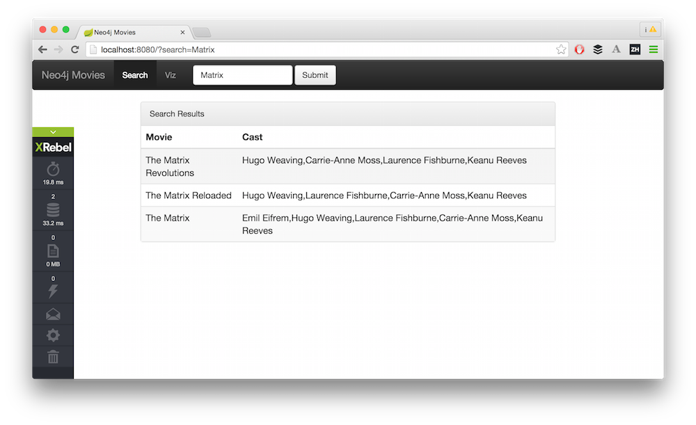
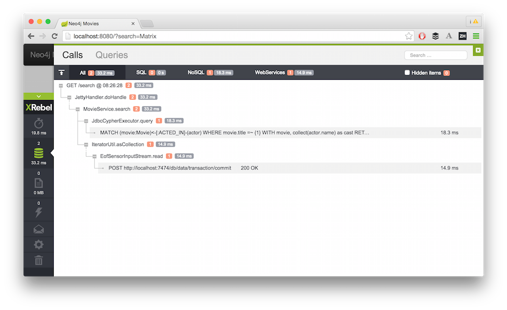
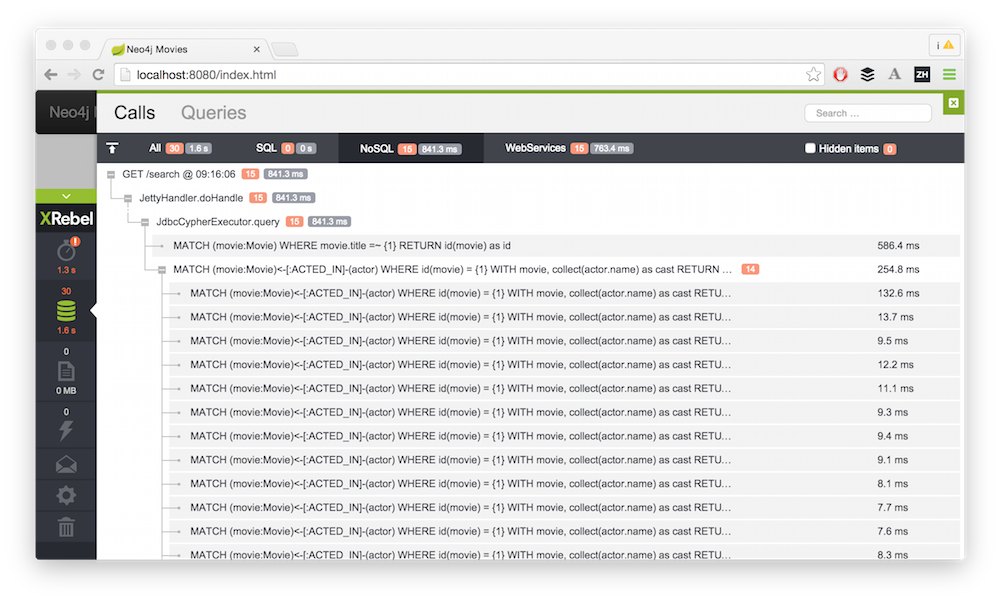

== Using XRebel 2 with Neo4j

At Spring.IO in Barcelona I met my pal Oleg from ZeroTurnaround and we looked at how the new https://zeroturnaround.com/software/xrebel[XRebel 2] 
integrates with http://neo4j.com[Neo4j], especially with the remote access using the *transactional Cypher http-endpoint*.

As you probably know, Neo4j currently offers a remoting API based on HTTP requests (a new binary protocol is in development).

Our *JDBC driver* utilizes that http-based protocol to connect to the database and execute parameterized statements while adhering to the JDBC APIs.

*XRebel* is a lightweight Java Application Profiler which is loaded as java-agent and instruments your application.
It traces runtime for web requests and records your backend-application CPU usage, database- (JDBC) and http-requests to other services.
For web-applications it integrates automatically with the http-processing and injects profiling information into the response. 

=== Movies Webapp

For this quick demo, we use the example http://neo4j.com/developer/example-project[Movies application] which is available for many programming languages from our http://neo4j.com/developer/language-guides[developer resources].
The application is just a plain Java webapp that serves three JSON endpoints to a simple Javascript frontend page.
The backend connects to Neo4j via JDBC to retrieve the requested information via our http://neo4j.com/developer/cypher[Cypher] query language.

To prepare for running our app, just http://neo4j.com/download[download, unzip and start Neo4j], open it on http://localhost:7474/ and run the `:play movies` statement in the Neo4j browser.
Then we can get and build the application and run it.
To test that it works, open the app in your browser at http://localhost:8080

----
git clone http://github.com/neo4j-contrib/developer-resources
cd developer-resources/language-guides/java/jdbc

mvn compile exec:java -DmainClass="org.neo4j.example.movies.Movies"
----

=== Setup with XRebel

To use XRebel we just https://zeroturnaround.com/software/xrebel[download it, get an eval license] and attach the jar as a java-agent to our application.

[source]
----
MAVEN_OPTS="-javaagent:$HOME/Downloads/xrebel/xrebel.jar" mvn compile exec:java -DmainClass="org.neo4j.example.movies.Movies"
----

If we check our example application page again, we see a small green XRebel icon in the left corner.
It provides access to the XRebel UI which has tabs for application performance, database queries, exceptions and more.

For our initial query for the "Matrix" movie, it shows both the request time for the web-application, as well as the database calls to Neo4j.
Interestingly both the JDBC level as well as the underlying http calls to Neo4j are displayed.

If we uglify our app, that our queries are executed incorrectly, simulating a n+1 select, then that shows clearly up in XRebel as massive database interaction.

Runtime Exceptions due to a programming error are also made immediately accessible from the XRebel UI.

For non-visual REST-services you can access the same profiling information via a special endpoint that is added to your application, in our case: http://localhost:8080/xrebel

As you can see, XRebel can give you quick insights in the performance profile of your Neo4j backed application and highlights which queries / pages / secondary requests
need further optimization.

Ping http://twitter.com/shelajev[Oleg] or http://twitter.com/mesirii[me] if you have more questions.

If you're in London this week and want to have a relaxing election day, 
make sure to grab a seat for http://graphconnect.com[GraphConnect] on May 7, *the* Neo4j conference. 
Ping me via email (michael at neo4j.org) for a steep discount a an avid reader of this blog.